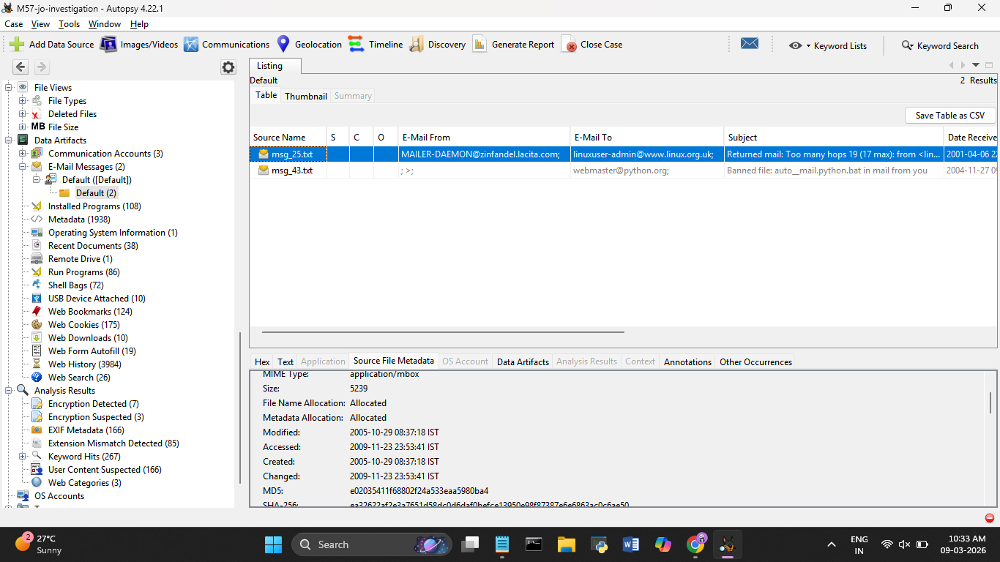
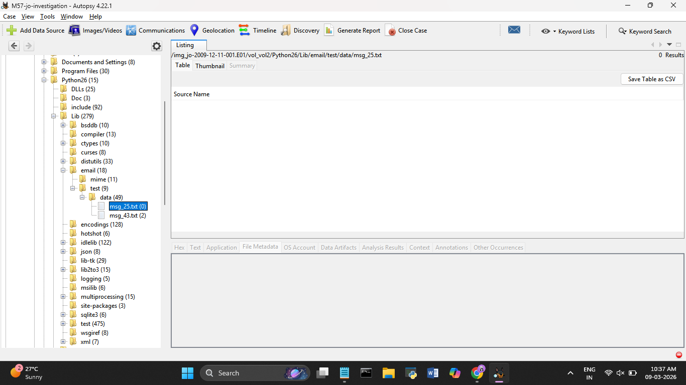
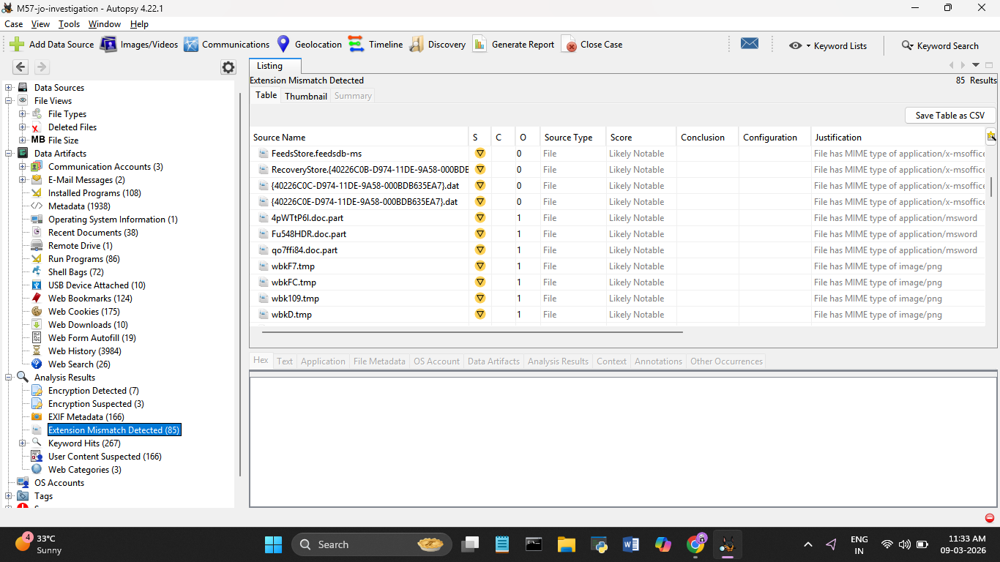
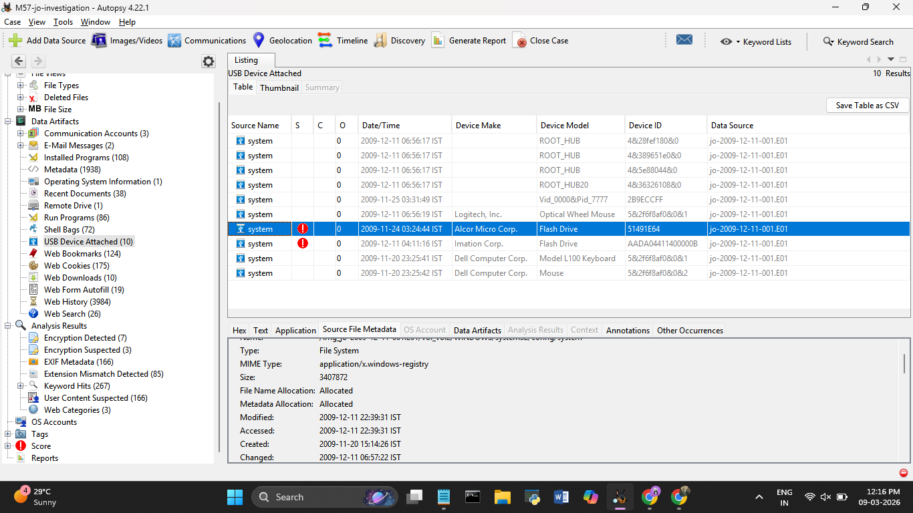

# Day 6 — 09 March 2026
**Internship:** RISE — Cyber Forensics & Threat Intelligence  
**Project:** M57 Digital Forensics Investigation  
**Phase:** Phase 2 — File System & USB Analysis  
**Status:** 🔄 In Progress

---

## Overview
Started today by doing a deeper look at msg_25.txt — wanted to understand what it 
actually is before moving on. That led to something I didn't expect. Both emails 
that Autopsy shows under the Default mailbox aren't stored in any normal email 
location. They're both sitting inside the Python26 library folder on disk, same 
place msg_43's attachment was found yesterday. Same folder, same timestamps on both 
files. After that went through the extension mismatches and USB devices.

---

## msg_25.txt — Deeper Analysis

**File Location:**
```
/img_jo-2009-12-11-001.E01/vol_vol2/Python26/Lib/email/test/data/msg_25.txt
```

Same folder as msg_43. Both emails are stored inside Python's library test data 
folder — not in any mailbox, inbox, or email client directory. Autopsy surfaces 
them under the Default mailbox in the artifact view but on disk they're both hidden 
inside a system folder.

**File Timestamps:**

| | IST |
|--|-----|
| Modified | 2005-10-29 08:37:18 |
| Accessed | 2009-11-23 23:53:41 |

Identical timestamps to msg_43. Both files modified the same date in 2005 and 
accessed at the exact same time in November 2009 — `23:53:41`, same second. 
They were opened together, deliberately, three weeks before the incident.



msg_25.txt has **0 attachments** — browsing into it from the file tree shows nothing 
inside. Unlike msg_43 it didn't carry a payload, but being in the same folder with 
identical timestamps means it was placed there at the same time.



**Hex analysis of msg_25.txt:**

Decoded the full hex content. It's a MAILER-DAEMON bounce from 2001 — a "Too many 
hops" failure for a Linux mailing list. Looks like a random old email on its own. 
In context with msg_43 the pattern is obvious:

| | msg_25.txt | msg_43.txt |
|--|-----------|-----------|
| Type | MAILER-DAEMON bounce | MAILER-DAEMON bounce (spoofed) |
| Fake date | 2001 | 2004 |
| Sent from | zinfandel.lacita.com (204.245.199.98) | kgsav.org (70.242.162.63) |
| Routed through | www.linux.org.uk | sacspam01.dot.ca.gov |
| Mail server | Exim 3.13 (old Unix MTA) | SMTP spam filter |
| Stored | Python26/Lib/email/test/data/ | Python26/Lib/email/test/data/ |
| Accessed | 2009-11-23 23:53:41 IST | 2009-11-23 23:53:41 IST |

Both use the MAILER-DAEMON format. Both use falsified dates. Both sent from external 
servers unrelated to M57's network. msg_25 looks like an **earlier attempt** using 
the same technique — routing through a Linux relay server rather than targeting 
government addresses. Jo likely kept it as a reference or template for msg_43. The 
Exim 3.13 mail server used in msg_25 is a very old Unix MTA from the early 2000s — 
obscure, harder to trace than modern infrastructure.

**Pattern confirmed across both files:**
- Fake dates to confuse timeline (2001, 2004 — incident is 2009)
- Different external relay servers to avoid detection
- Both hidden in the same Python system folder
- Both accessed at the exact same second in November 2009

---

## Extension Mismatches — Jo's Files

Went back through the 85 extension mismatch results and filtered by owner:

| Owner | Count |
|-------|-------|
| Jo (Documents and Settings/Jo) | 11 |
| Administrator | 8 |
| All Users | 2 |
| Program Files | 64 |

The 64 Program Files hits are likely false positives — software installs commonly 
have files like this. The **11 files belonging to Jo** are the suspicious ones. 
These include `.doc.part` files — partial Word documents downloaded from the web — 
and temp files that are actually MS Word documents. Bookmarked all 11 in Autopsy.



---

## USB Devices Attached

*Source: Autopsy → Data Artifacts → USB Device Attached (10 results)*

| Date/Time (IST) | Device Make | Device Model | Device ID |
|----------------|-------------|--------------|-----------|
| 2009-12-11 06:56:17 | — | ROOT_HUB | 4&28fef180&0 |
| 2009-12-11 06:56:17 | — | ROOT_HUB | 4&389651e0&0 |
| 2009-12-11 06:56:17 | — | ROOT_HUB | 4&5e88044&0 |
| 2009-12-11 06:56:17 | — | ROOT_HUB20 | 4&36326108&0 |
| 2009-11-25 03:31:49 | — | Vid_0000&Pid_7777 | 2B9ECCFF |
| 2009-12-11 06:56:19 | Logitech, Inc. | Optical Wheel Mouse | 5&2f6f8af0&0&1 |
| 2009-11-24 03:24:44 ⚠️ | Alcor Micro Corp. | Flash Drive | 51491E64 |
| 2009-12-11 04:11:16 ⚠️ | Imation Corp. | Flash Drive | AADA04411400000B |
| 2009-11-20 23:25:41 | Dell Computer Corp. | Model L100 Keyboard | 5&2f6f8af0&0&12 |
| 2009-11-20 23:25:42 | Dell Computer Corp. | Mouse | 5&2f6f8af0&0&2 |

Two flash drives stand out — an **Alcor Micro flash drive** connected on 
**2009-11-24** and an **Imation flash drive** connected on **2009-12-11** (the 
incident date itself). The Imation drive connecting on the exact date of the disk 
image is worth investigating further. The unknown `Vid_0000&Pid_7777` device with 
no make or model is also unusual — unrecognized hardware.



---

## What I Learned Today
- Both emails being in the Python26 folder with identical access timestamps means 
  they weren't just stored there — they were used together as a set
- Same-second access timestamps across two files is a strong indicator of scripted 
  or programmatic access, not manual browsing
- Exim 3.13 is a deliberately old mail server — using outdated infrastructure is 
  itself an anti-forensics technique
- msg_25 being an earlier version of the same attack technique shows this wasn't 
  improvised — there was a learning and refinement process

---
