# Day 7 — 10 March 2026
**Internship:** RISE — Cyber Forensics & Threat Intelligence  
**Project:** M57 Digital Forensics Investigation  
**Phase:** Phase 2 — Web History, Downloads, Encryption & Installed Programs  
**Status:** ✅ Complete

---

## Overview
Long day. Went through deleted files, web history, web downloads, web search terms,
encryption detected, web cookies, and installed programs. The web history alone took
most of the morning — 3,984 entries mostly USPTO patent searches, but the suspicious
ones were worth finding. The biggest discovery today wasn't any single artifact — it
was realising that the same timestamp `2009-12-11 04:11:33 IST` appears across web
history, downloads, searches, and cookies. That's not each item being accessed at the
same second. That's Firefox's SQLite database file being touched once at that time on
the incident date. Everything stored in that database carries the file's access time,
not the individual record times. Important to document this correctly so it doesn't
get misread in the final report.

---

## Deleted Files — Deep Dive

Already overviewed the deleted files on Day 2. Today went deeper — sorted by modified
time to filter recently deleted files. Found approximately **40 files deleted on the
incident date (2009-12-11)**, majority `.dat` and `.tmp` files. The `sc10.bin.tmp`
file flagged on Day 2 stands out again here — deleted on the incident date, ~3MB size
which is abnormal for a temp storage file, and unique in having intact timestamps while
everything around it was wiped.

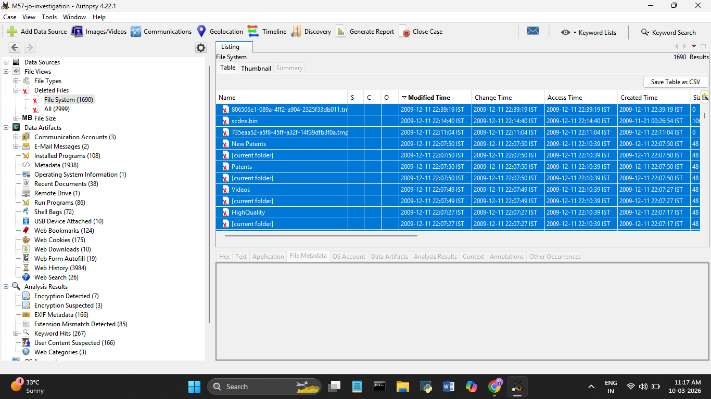

---

## Web History — Suspicious Findings

*Source: Autopsy → Data Artifacts → Web History (3,984 results)*

The majority of web history is USPTO patent searches — quantum, cryptography, time
machine, cryogenics, immortality. Consistent with Jo's role. The following were
separated out as suspicious:

**TrueCrypt** — visited truecrypt.org, went to downloads page, downloaded the
installer. All within 71 seconds on `2009-12-04 02:12:30 IST`. Directly explains
the 7 Encryption Detected files flagged by Autopsy.

**Python** — searched "python" on Google, visited python.org, downloaded Python 2.6.4
MSI. All within 12 seconds on `2009-11-23 23:50:00 IST`. The email files msg_25.txt
and msg_43.txt were accessed 4 minutes later at `23:53:41`. Python was installed then
the emails were opened immediately after.

**M57 Webmail** — three entries for `webmail.m57.biz` (login, webmail, signout) with
all timestamps stripped. A complete corporate webmail session with no timing evidence.
Supports the theory that emails were deleted through the webmail interface.

**NIST spreadsheet** — `usms.nist.gov/resources/MNs/MNspreadsheetTagged.csv` accessed
13 times from `2009-11-25` to `2009-12-10`. Accessed on nearly every investigation day.

**NOAA security document** — `easc.noaa.gov/Security/webfile/erso.doc.gov/briefings/STU.doc`
— 12 entries, all timestamps wiped. STU likely refers to Secure Telephone Unit, a US
government classified communications device. Accessing a government security briefing
document 12 times and wiping all timestamps is deliberate anti-forensics.

**docCrawler** — automated tool running against the USPTO patent server 13 times across
the full investigation period. Not manual browsing — scripted or automated collection.
Runs appear on the same dates as the NIST spreadsheet accesses.

**Lawrence Berkeley Lab** — two cryptography research papers from the OPKeyX public
key cryptography project downloaded. Combined with the cryptography patent searches
and TrueCrypt install, shows active research into and implementation of encryption.

**Quicktime from 7-n0w.com** — searched QuickTime, clicked a Google ad, landed on
`7-n0w.com` — not Apple's official domain. Classic lookalike/malvertising site.

**Wikipedia "Nigerian prince"** — same day as TrueCrypt download (`2009-12-04`).

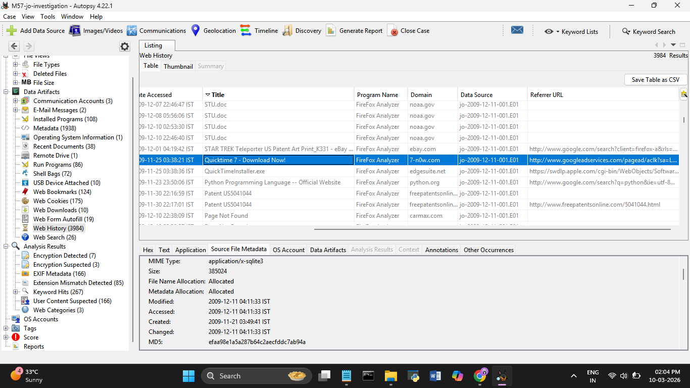

---

## Downloads Folder — File Tree

*Path: Documents and Settings/Jo/My Documents/Downloads*

Browsing Jo's Downloads folder revealed the actual files that were downloaded and
kept on disk:

| File | Size | Created (IST) | Modified (IST) |
|------|------|--------------|----------------|
| TrueCrypt Setup 6.3a.exe | 3,358,880 bytes | 2009-12-04 02:13:42 | 2009-12-04 02:13:48 |
| TrueCrypt Setup 6.3a.exe:Zone.Identifier | 46 bytes | 2009-12-04 02:13:42 | 2009-12-04 02:13:48 |
| install_flash_player.exe | 1,925,024 bytes | 2009-12-01 04:14:09 | 2009-12-01 04:14:09 |
| AdbeRdr920_en_US.exe | 27,386,280 bytes | 2009-11-30 22:18:53 | 2009-11-30 22:19:04 |
| US5041044.pdf | 550,494 bytes | 2009-11-30 22:17:01 | 2009-11-30 22:17:02 |
| QuickTimeInstaller.exe | 32,494,896 bytes | 2009-11-25 03:38:37 | 2009-11-25 03:38:50 |

**Zone.Identifier files** — these are created by Windows when a file is downloaded
from the internet, marking it as coming from an untrusted zone. Their presence confirms
TrueCrypt was downloaded from the web, not copied from another source.

**US5041044.pdf** — a US patent document downloaded to Jo's personal Downloads folder.
Needs further examination to determine what patent this covers and whether it's related
to M57's work.

**QuickTimeInstaller.exe** — 32MB installer. Given the QuickTime download came from
`7-n0w.com` (lookalike site) rather than Apple, this file is suspicious. MIME type
`application/x-dosexec` confirmed.

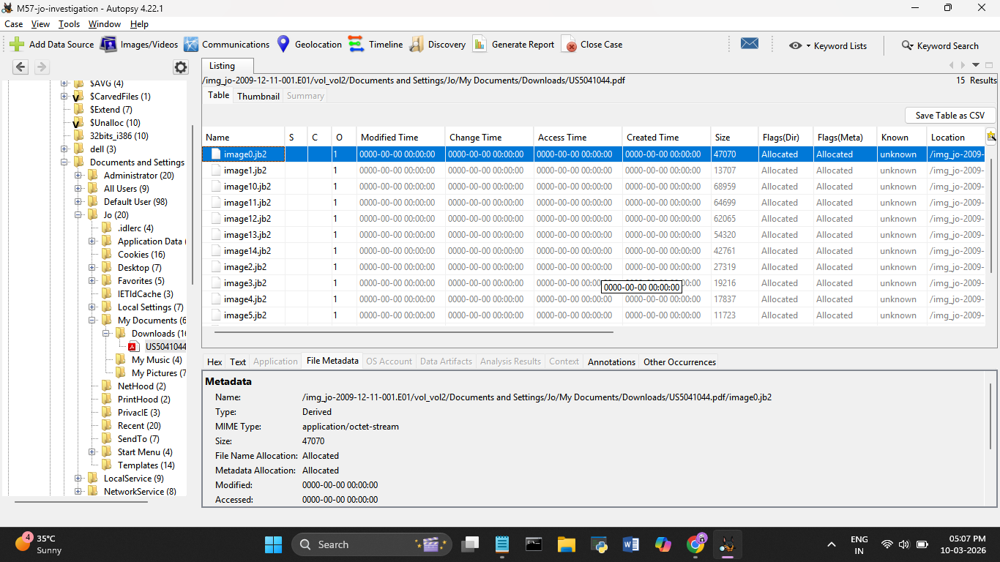
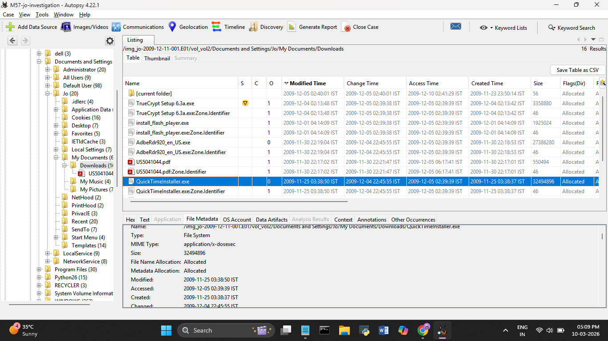

---

## Web Downloads

*Source: Autopsy → Data Artifacts → Web Downloads (10 results)*

| URL | Date Accessed (IST) |
|-----|-------------------|
| python.org/ftp/python/2.6.4/python-2.6.4.msi | 2009-11-23 23:50:12 |
| easc.noaa.gov/.../STU.doc | 2009-11-25 02:48:18 |
| appldnld.apple.com.edgesuite.net (QuickTime) | 2009-11-25 03:38:36 |
| freepatentsonline.com/pdf_collections_se... | 2009-11-30 22:16:59 |
| ardownload.adobe.com/.../AdbeRdr920_en_US.exe | 2009-11-30 22:18:51 |
| fpdownload.adobe.com/get/flashplayer/... | 2009-12-01 04:14:07 |
| truecrypt.org/download/.../TrueCrypt Setup 6.3a.exe | 2009-12-04 02:13:41 |
| Firefox%20Setup%203.5[1].exe:Zone.Identifier | — |
| R79733[1].EXE:Zone.Identifier | — |
| OOo_3.1.1_Win32Intel_install_wJRE_en-US.exe:Zone | — |

**STU.doc confirmed as a download** — appears in the Web Downloads list with a
timestamp of `2009-11-25 02:48:18`. This confirms the NOAA security document was
actually downloaded to the machine, not just visited.

**R79733[1].EXE** — unknown executable downloaded, no URL or timestamp. The filename
pattern `R79733` doesn't match any standard software. Flagged for further investigation.

**OOo_3.1.1** — OpenOffice installer Zone.Identifier. OpenOffice was downloaded at
some point — useful for opening and editing documents without Microsoft Office.

The Web Downloads database file (`downloads.sqlite`) has:
- Modified: `2009-12-04 02:13:48 IST`
- Accessed: `2009-12-11 04:11:33 IST` ← same Firefox database access time

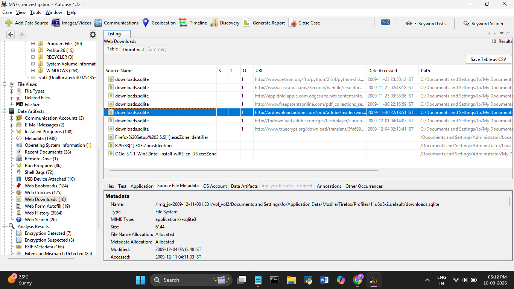

---

## Web Search Terms

*Source: Autopsy → Data Artifacts → Web Search (26 results)*

All searches from Firefox's `places.sqlite`. Notable searches:

| Search Term | Date (IST) |
|------------|-----------|
| mozrepl | 2009-11-23 23:47:55 |
| python | 2009-11-23 23:50:00 |
| cnn | 2009-11-23 23:52:31 |
| quicktime | 2009-11-25 03:38:23 |
| http://Quicktime.7-n0w.com | 2009-11-25 03:38:21 |
| cnn.com | 2009-11-30 22:14:56 |
| teleporter patent | 2009-11-30 22:16:49 |
| adobe pdf | 2009-11-30 22:17:31 |
| teleporter patent | 2009-12-01 04:19:34 |
| google maps | 2009-12-01 04:21:00 |

**mozrepl** — Mozilla REPL (Read-Eval-Print Loop) is a Firefox extension that allows
remote scripting and automation of the browser via a network connection. Searching for
this is suspicious — it's a developer/hacker tool that can be used to control Firefox
programmatically, consistent with the automated docCrawler activity seen in history.

The `places.sqlite` metadata shows:
- Modified: `2009-12-11 04:11:33 IST`
- Accessed: `2009-12-11 04:11:33 IST`

All individual search record timestamps reflect this same database file access time —
not the time each search was performed. The actual search times come from the search
text column records above.

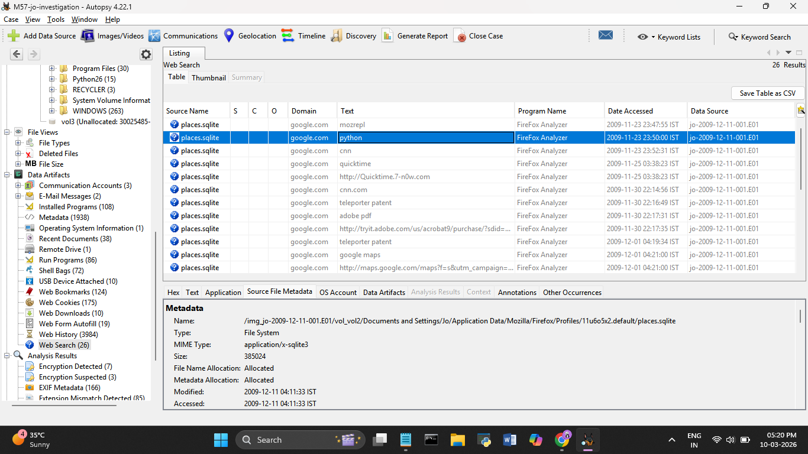
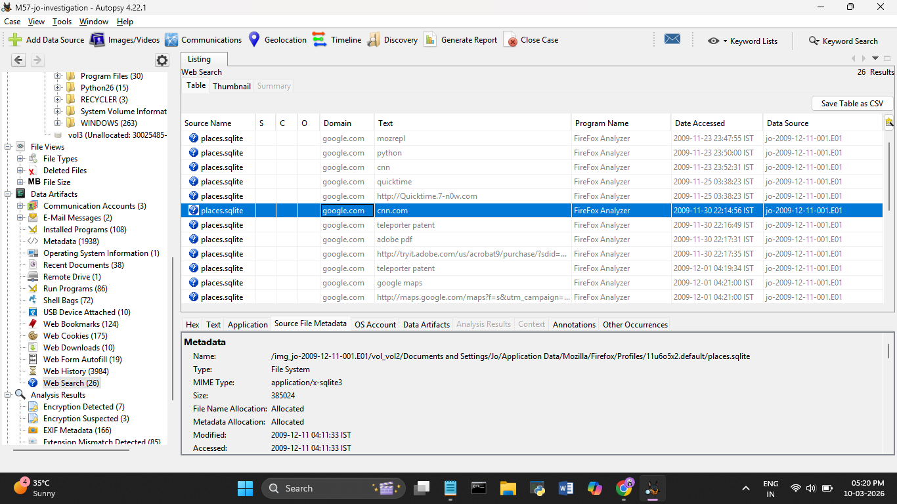
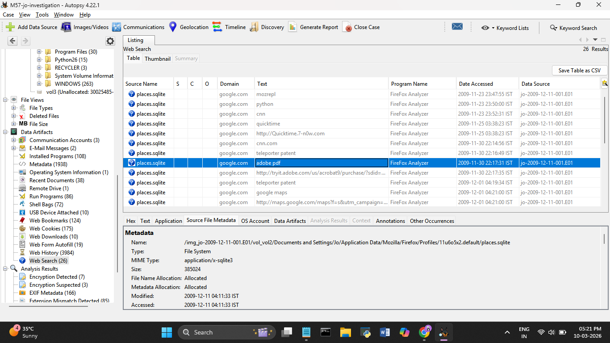

---

## Encryption Detected

*Source: Autopsy → Analysis Results → Encryption Detected (7 results)*

All 7 files are password-protected ZIP archives located in AVG antivirus folders —
the same area where `sc10.bin.tmp` was found on Day 2:

| File | Path | Size | Modified (IST) | Accessed (IST) |
|------|------|------|----------------|----------------|
| internalList.zip | Administrator/Local Settings/Temp/AVGDownloadManager/packages/13/ | 2,266,301 | 2009-11-21 00:25:43 | 2009-11-21 00:25:43 |
| internalList.zip | All Users/Application Data/avg9/IDS/Config/ | 2,352,551 | 2009-12-05 07:21:10 | 2009-12-11 06:56:51 |
| internalList.zip.bak | All Users/Application Data/avg9/IDS/Config/ | 2,352,551 | 2009-12-05 07:21:10 | 2009-12-11 06:56:51 |
| quarantinedList.zip | All Users/Application Data/avg9/IDS/Config/ | — | — | 2009-12-11 06:56:51 |
| quarantinedList.zip.bak | All Users/Application Data/avg9/IDS/Config/ | — | — | 2009-12-11 06:56:51 |
| userList.zip | All Users/Application Data/avg9/IDS/Config/ | — | — | 2009-12-11 06:56:51 |
| userList.zip.bak | All Users/Application Data/avg9/IDS/Config/ | — | — | 2009-12-11 06:56:51 |

All 7 flagged as **Notable — Password protection detected**. Six of the seven were
accessed at `2009-12-11 06:56:51 IST` — on the incident date, around the same time
the Imation flash drive was connected (`06:56:17 IST`, just 34 seconds earlier).
The names — `internalList`, `quarantinedList`, `userList` — suggest these could be
AVG's internal database files, but their location inside the same AVG folder as
`sc10.bin.tmp` and their access time matching the flash drive insertion is suspicious.

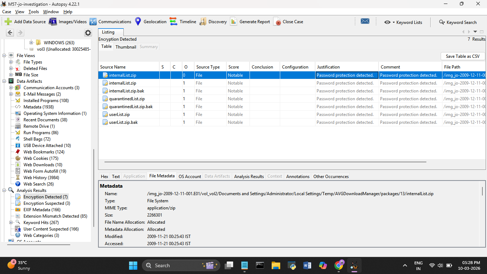
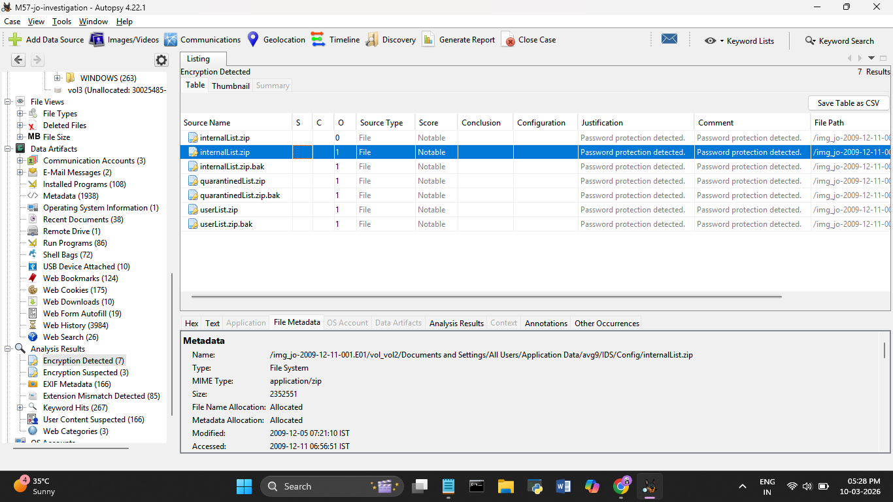
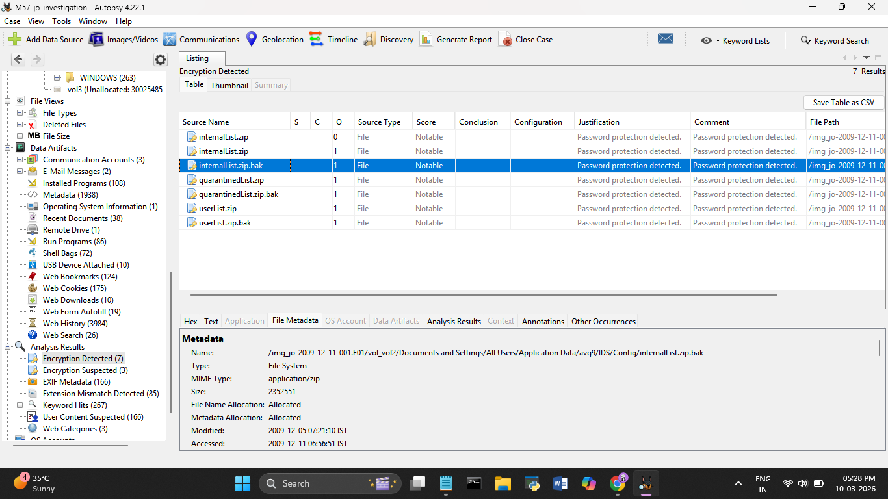

---

## Web Cookies

*Source: Autopsy → Data Artifacts → Web Cookies (175 results)*

Cookies stored in Firefox's `cookies.sqlite`. Domains present include: `apple.com`,
`adobe.com`, `cnn.com`, `mozilla.org`, `googleadservices.com`, `mediaplex.com`,
`atdmt.com`, `bluestreak.com`, `ebay.com`, `apmebf.com`.

Notable cookie — `bluestreak.com` (now part of DoubleClick/Google advertising network)
with a tracking ID cookie. Advertising tracker cookies are normal browser activity.

The `cookies.sqlite` file metadata:
- Modified: `2009-12-11 04:11:33 IST`
- Accessed: `2009-12-11 04:11:33 IST`

Same Firefox database access timestamp as web history and downloads. All cookie
"accessed" times reflect the database file touch time, not individual cookie activity.

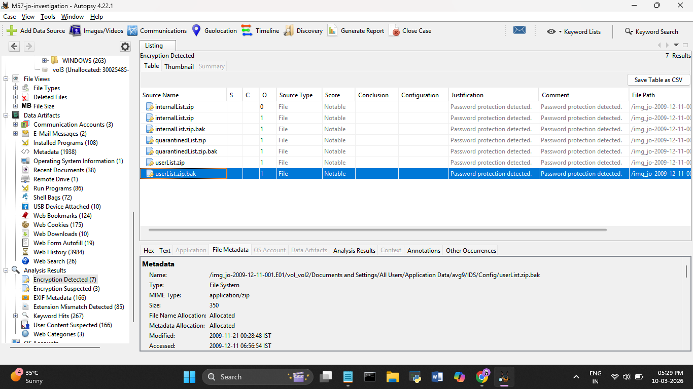
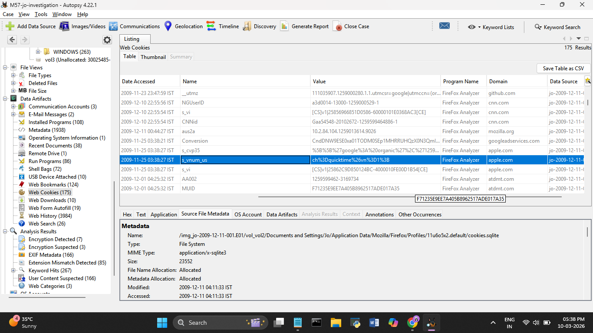
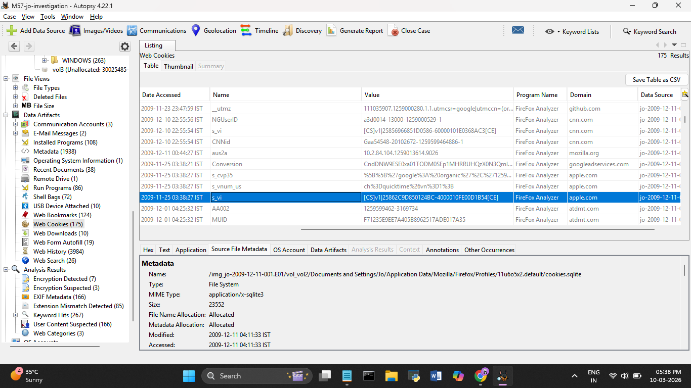

---

## Installed Programs

*Source: Autopsy → Data Artifacts → Installed Programs (108 results)*

108 installed programs. Most are standard Windows XP software and updates. Key findings:

| Program | Install Date (IST) |
|---------|-------------------|
| TrueCrypt v.6.3a | 2009-12-03 20:44:14 |
| Adobe Flash Player 10 Plugin v.10.0.32.18 | 2009-11-30 22:45:34 |
| Adobe Reader 9.2 v.9.2.0 | 2009-11-30 16:51:34 |
| Brother HL-2170W v.1.00 | 2009-11-30 17:34:53 |
| Multiple Windows XP Security Updates | 2009-12-09 |

**TrueCrypt v.6.3a confirmed installed on 2009-12-03** — one day before the web
history shows it being downloaded (`2009-12-04`). This is a minor discrepancy worth
noting — the registry install date (`Dec 03`) and the download timestamp (`Dec 04`)
are off by one day. Could be a timezone conversion issue between the registry and
Firefox's database, or the installer was run on Dec 03 after being downloaded late
on Dec 02. Either way, TrueCrypt was confirmed installed and present on the machine.

The Installed Programs source file `WINDOWS/system32/config/software` (Windows
registry) has:
- Modified: `2009-12-11 22:39:31 IST`
- Accessed: `2009-12-11 22:39:31 IST`

Same pattern — the registry file was touched at `22:39:31` on the incident date and
all program "accessed" times reflect that registry file access, not when each program
was last used.

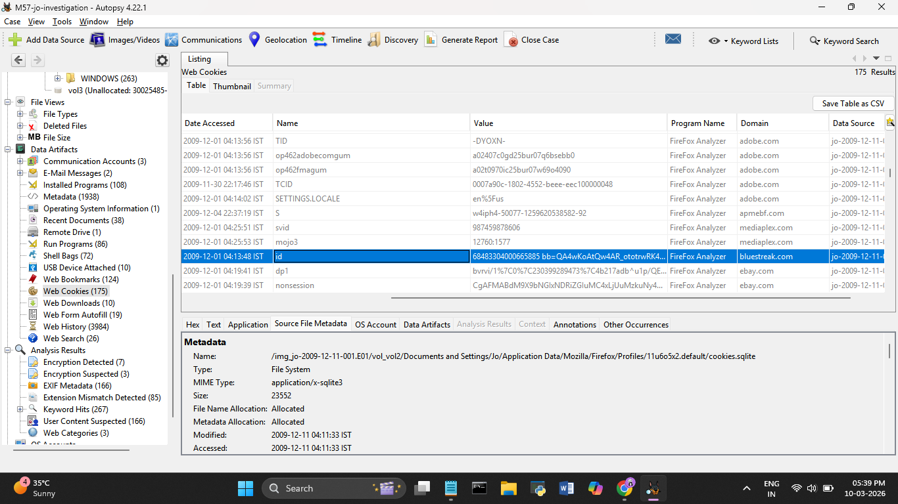
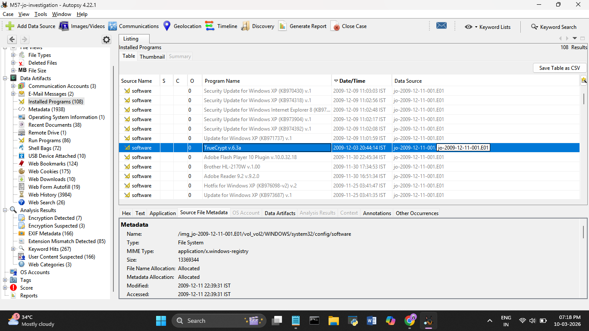
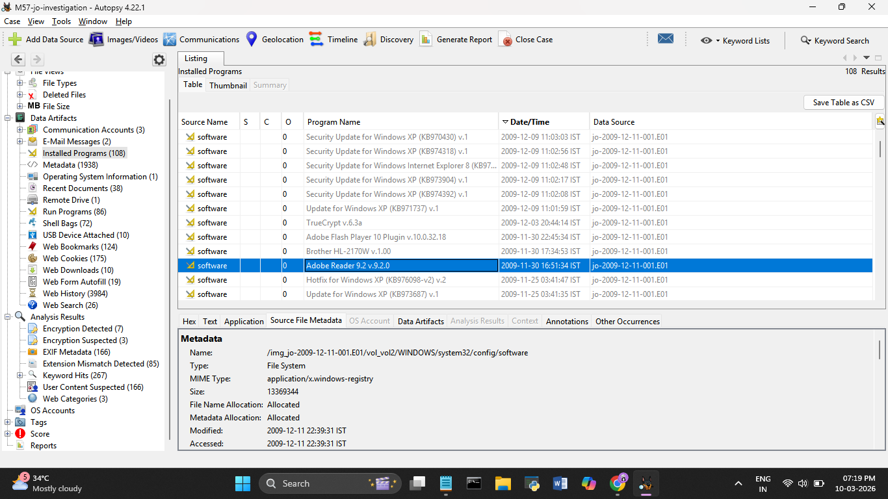
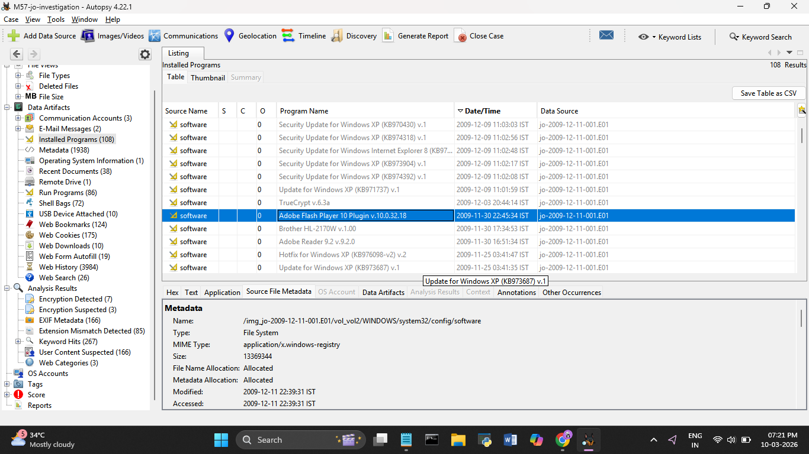

---

## Important Note on Timestamps

A pattern observed across multiple artifact categories today:

| Artifact Source | File | Timestamp |
|----------------|------|-----------|
| Web History, Search, Downloads, Cookies | places.sqlite / cookies.sqlite | 2009-12-11 04:11:33 IST |
| Installed Programs | WINDOWS/system32/config/software | 2009-12-11 22:39:31 IST |
| Encryption Detected (6 of 7) | avg9/IDS/Config/ files | 2009-12-11 06:56:51 IST |

When Autopsy shows the same timestamp across many different records, it is reflecting
the **database or registry file's access time**, not the time each individual record
was created or used. The actual event times must be taken from the data values within
each record — the URL column, the install date column, etc. — not from the file
metadata. This distinction is critical for accurate timeline reconstruction in the
final report.

---

## Key Timeline Additions

| Date/Time (IST) | Event |
|----------------|-------|
| 2009-11-21 00:25:43 | internalList.zip first appears in AVG folder |
| 2009-11-23 23:47:55 | mozrepl searched — browser automation tool |
| 2009-11-23 23:50:00 | Python downloaded |
| 2009-11-23 23:53:41 | msg_25 and msg_43 accessed — 4 min after Python |
| 2009-11-25 02:48:18 | STU.doc downloaded from NOAA |
| 2009-11-30 | Adobe Reader, Flash Player, Brother printer driver installed |
| 2009-12-03 20:44:14 | TrueCrypt installed (registry) |
| 2009-12-04 02:13:41 | TrueCrypt downloaded (Firefox) |
| 2009-12-05 07:21:10 | internalList.zip modified in AVG IDS Config |
| 2009-12-11 04:11:33 | Firefox databases accessed — web history, downloads, cookies |
| 2009-12-11 06:56:17 | Imation flash drive connected |
| 2009-12-11 06:56:51 | AVG encryption files accessed — 34 sec after flash drive |
| 2009-12-11 22:39:31 | Windows registry accessed |

---

## What I Learned Today
- The same timestamp across dozens of artifact records doesn't mean every event
  happened at the same time — it means the source database file was accessed once
  and everything in it carries that file's access time
- mozrepl is a browser automation tool — finding it searched alongside Python and
  docCrawler builds a picture of scripted, automated activity rather than manual use
- The 34-second gap between the Imation flash drive connecting and the AVG encrypted
  files being accessed is the kind of precise correlation that builds the attack timeline
- STU.doc being confirmed in Web Downloads (not just history) means the file was
  actually saved, not just visited

---
