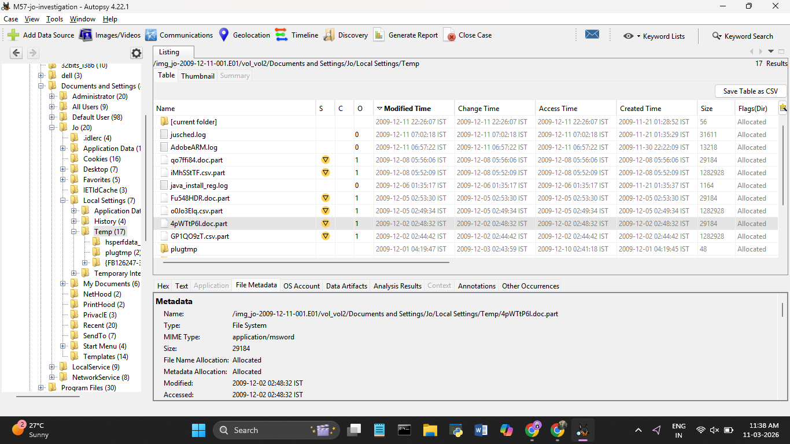

# Day 8 — 11 March 2026
**Internship:** RISE — Cyber Forensics & Threat Intelligence  
**Project:** M57 Digital Forensics Investigation  
**Phase:** Phase 2 — Temp Folder & Doc.Part Analysis  
**Status:** ✅ Complete

---

## Overview
 Extracted the 3 `.doc.part` files from Jo's Temp folder and
found what's inside them. Also found 3 more `.csv.part` files in the same folder
that weren't flagged before — both sets downloaded on the exact same dates, pointing
to a single automated script running both downloads together.

---

## .doc.part Files — Content

All three files are identical in size (29,184 bytes) and contain the same document.

| File | Modified (IST) |
|------|---------------|
| 4pWTtP6l.doc.part | 2009-12-02 02:48:32 |
| Fu548HDR.doc.part | 2009-12-05 02:53:30 |
| qo7ffi84.doc.part | 2009-12-08 05:56:06 |

The document is the **STU-III Briefing — Department of Commerce, Office of Security**.
The metadata reveals the original path: `D:\PROJECTS\noaa\Written Briefings\STU.doc`
— an internal NOAA project folder, not a public server. Author: Carroll Ward,
Company: DOC/OSY/ERSO (Department of Commerce / Office of Security / Eastern Region).

The STU-III is a US government encrypted telephone system used for classified
communications. The briefing covers Controlled Cryptographic Items, Crypto Ignition
Keys, security clearance procedures, and COMSEC custody requirements. Jo had no
legitimate reason to have this on her machine. The randomised filenames confirm these
were downloaded by a script, not saved manually.

---

## .csv.part Files — New Finding

Three more partial downloads found by browsing the Temp folder directly:

| File | Size | Modified (IST) |
|------|------|---------------|
| GP1QO9zT.csv.part | 1,282,928 | 2009-12-02 02:44:42 |
| o0Jo3Elq.csv.part | 1,282,928 | 2009-12-05 02:49:34 |
| iMhSStTF.csv.part | 1,282,928 | 2009-12-08 05:52:09 |

Same size, same randomised naming pattern, same three dates as the `.doc.part` files.
Almost certainly the NIST `MNspreadsheetTagged.csv` that appeared 13 times in web
history. The script was downloading both files on each run:

| Date | .doc.part | .csv.part |
|------|-----------|-----------|
| 2009-12-02 | 4pWTtP6l.doc.part | GP1QO9zT.csv.part |
| 2009-12-05 | Fu548HDR.doc.part | o0Jo3Elq.csv.part |
| 2009-12-08 | qo7ffi84.doc.part | iMhSStTF.csv.part |

---

## What I Learned Today
- `.doc.part` files still contain full readable content even if the download didn't
  complete — document metadata survives and reveals the original source path
- The `.csv.part` files only showed up by browsing the file tree manually — not
  everything gets caught by Autopsy's analysis modules

---
