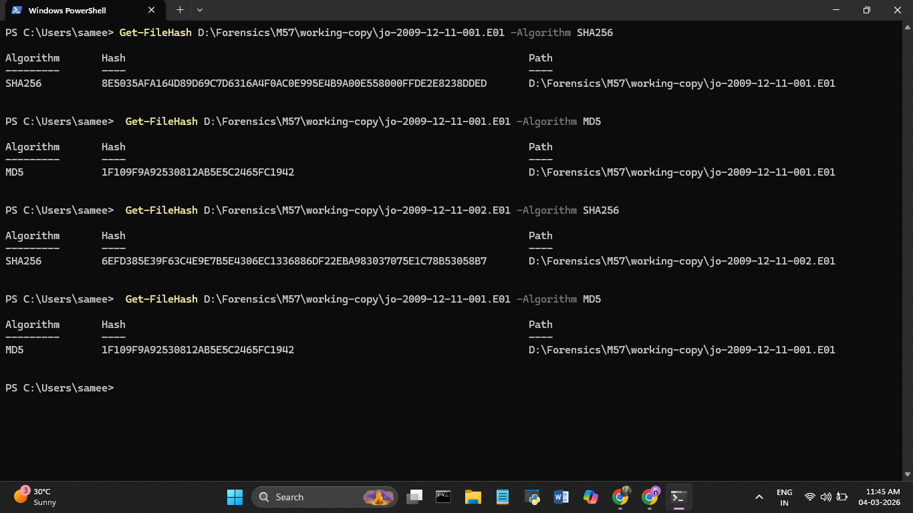
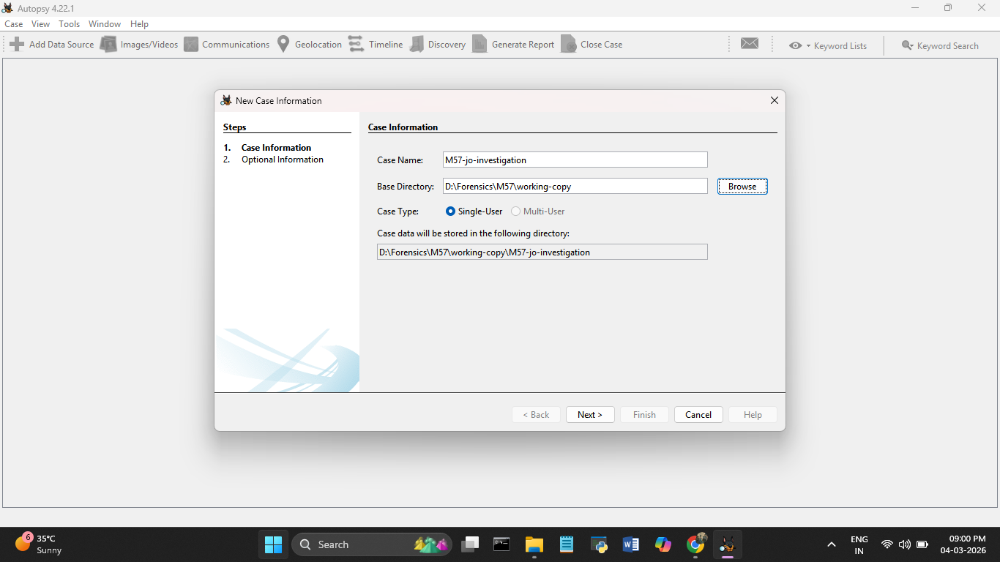
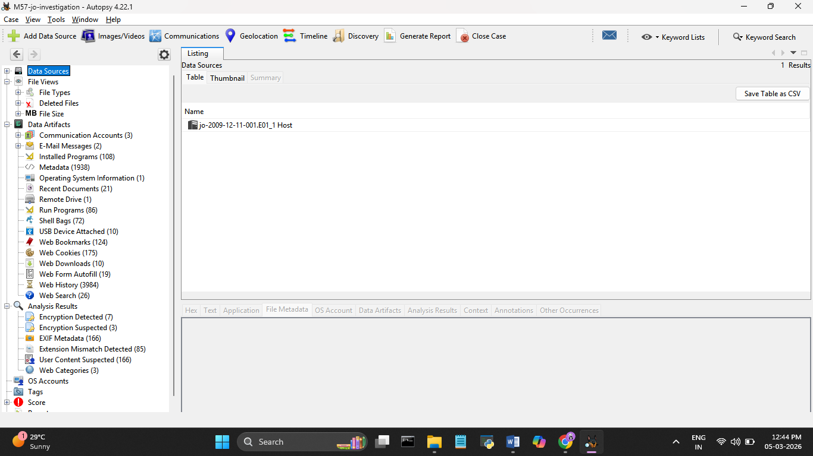

# Day 1 — 04 March 2026
**Internship:** RISE — Cyber Forensics & Threat Intelligence  
**Project:** M57 Digital Forensics Investigation  
**Phase:** Phase 1 — Environment Setup & Evidence Acquisition  
**Status:** ✅ Complete

---

## Overview
Day 1 focused on setting up the complete forensic investigation environment, 
acquiring and preserving the M57 disk image evidence, verifying integrity through 
cryptographic hashing, creating the Autopsy case, and running all ingest modules 
to extract artifacts from Jo's laptop disk image.

---

## Tasks Completed
- ✅ Downloaded M57 disk image from Digital Corpora (legally shareable forensic dataset)
- ✅ Created working copy — all analysis performed on copy, never the original
- ✅ Set original evidence files to Read-Only
- ✅ Generated SHA256 and MD5 hashes for both E01 segments via PowerShell
- ✅ Verified all tool versions
- ✅ Created Autopsy case: M57-JoInvestigation
- ✅ Loaded E01 data source into Autopsy
- ✅ Ran all ingest modules — ingest completed fully
- ✅ Recorded OS information and final artifact counts

---

## Evidence Details
| Item | Details |
|------|---------|
| Evidence File 1 | jo-2009-12-11-001.E01 (~6 GB) |
| Evidence File 2 | jo-2009-12-11-002.E01 (~6 GB) |
| Total Image Size | 15,382,241,280 bytes (~15 GB) |
| Image Format | E01 — EnCase Expert Witness Format |
| Sector Size | 512 bytes |
| Source | https://digitalcorpora.org/ |
| Original Path | D:\Forensics\M57\Evidence\ |
| Working Copy Path | D:\Forensics\M57\working-copy\ |
| Autopsy Case Name | M57-jo-investigation |
| Device ID | fe9f692e-268a-4166-b4a3-5d91cc334cd2 |

---

## Tool Versions
| Tool | Version | Platform |
|------|---------|----------|
| Autopsy | 4.22.1 | Windows |
| Kali Linux | 2025.4 | Host OS |
| Wireshark | 4.6.2 | Kali Linux |
| Volatility 3 | Framework 2.28.0 | Kali Linux |
| PowerShell | Built-in | Windows |

---

## Hash Verification
Hashes generated using PowerShell Get-FileHash for both SHA256 and MD5.  
These values confirm the working copy is an exact, unmodified duplicate of the original.
```powershell
Get-FileHash D:\Forensics\M57\working-copy\jo-2009-12-11-001.E01 -Algorithm SHA256
Get-FileHash D:\Forensics\M57\working-copy\jo-2009-12-11-001.E01 -Algorithm MD5
Get-FileHash D:\Forensics\M57\working-copy\jo-2009-12-11-002.E01 -Algorithm SHA256
Get-FileHash D:\Forensics\M57\working-copy\jo-2009-12-11-002.E01 -Algorithm MD5
```

| File | Algorithm | Hash Value |
|------|-----------|------------|
| jo-2009-12-11-001.E01 | SHA256 | 8E5035AFA164D89D69C7D6316A4F0AC0E995E4B9A00E558000FFDE2E8238DDED |
| jo-2009-12-11-001.E01 | MD5 | 1F109F9A92530812AB5E5C2465FC1942 |
| jo-2009-12-11-002.E01 | SHA256 | 6EFD385E39F63C4E9E7B5E4306EC1336886DF22EBA983037075E1C78B53058B7 |
| jo-2009-12-11-002.E01 | MD5 | 1F109F9A92530812AB5E5C2465FC1942 |



---

## Autopsy Case Setup
Created a new case with the following configuration:
| Item | Value |
|------|-------|
| Case Name | M57-JoInvestigation |
| Case Number | M57-2009-001 |
| Data Source | jo-2009-12-11-001.E01 (working copy) |
| Note | Second segment auto-detected by Autopsy |




---

## Ingest Modules Run
- Hash Lookup
- File Type Identification
- Recent Activity
- Keyword Search
- Email Parser
- Extension Mismatch Detector

## Final Artifact Counts
| Artifact Category | Count |
|-------------------|-------|
| Communication Accounts | 3 |
| E-Mail Messages | 2 |
| Installed Programs | 108 |
| Metadata | 1,938 |
| Operating System Information | 1 |
| Recent Documents | 21 |
| Remote Drive | 1 |
| Run Programs | 86 |
| Shell Bags | 72 |
| USB Devices Attached | 10 |
| Web Bookmarks | 124 |
| Web Cookies | 175 |
| Web Downloads | 10 |
| Web Form Autofill | 19 |
| Web History | 3,984 |
| Web Search Terms | 26 |
| Encryption Detected | 7 |
| Encryption Suspected | 3 |
| EXIF Metadata | 166 |
| Extension Mismatch Detected | 85 |
| User Content Suspected | 166 |
| Web Categories | 3 |



---
## Key Learning
- Never work on original evidence — always use a verified, hashed working copy
- SHA256 + MD5 together provide strong integrity verification
- Autopsy ingest modules automate extraction of hundreds of artifact categories
---
