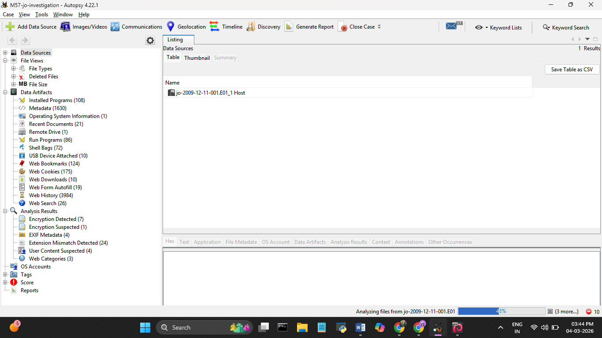

# Day 1 — 04 March 2026
**Phase:** Environment Setup & Evidence Acquisition  
**Status:** ✅ Complete

## What I Did
- Downloaded M57 disk image from Digital Corpora (legally shareable dataset)
- Created working copy at `D:\Forensics\M57\working-copy\`
- Set original evidence files to Read-Only
- Generated SHA256 and MD5 hashes for both segments via PowerShell
- Verified all tools: Autopsy 4.22.1, Kali Linux 2025.4, Wireshark 4.6.2, Volatility 3
- Created Autopsy case: M57-JoInvestigation, loaded E01 data source

## Hash Values
| File | Algorithm | Hash |
|------|-----------|------|
| jo-2009-12-11-001.E01 | SHA256 | 8E5035AFA164D89D69C7D6316A4F0AC0E995E4B9A00E558000FFDE2E8238DDED |
| jo-2009-12-11-001.E01 | MD5 | 1F109F9A92530812AB5E5C2465FC1942 |
| jo-2009-12-11-002.E01 | SHA256 | 6EFD385E39F63C4E9E7B5E4306EC1336886DF22EBA983037075E1C78B53058B7 |
| jo-2009-12-11-002.E01 | MD5 | 1F109F9A92530812AB5E5C2465FC1942 |

## Screenshots

## Key Learning
The golden rule of forensics — never touch the original evidence.  
Always work from a verified, hashed working copy.
