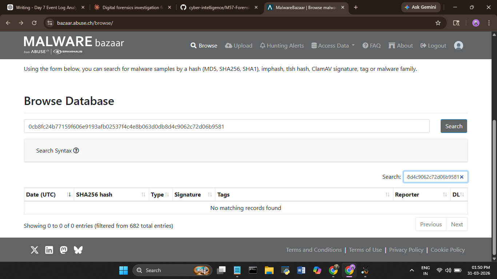
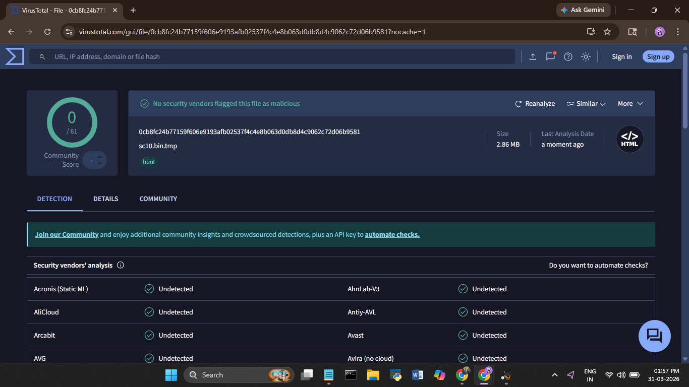
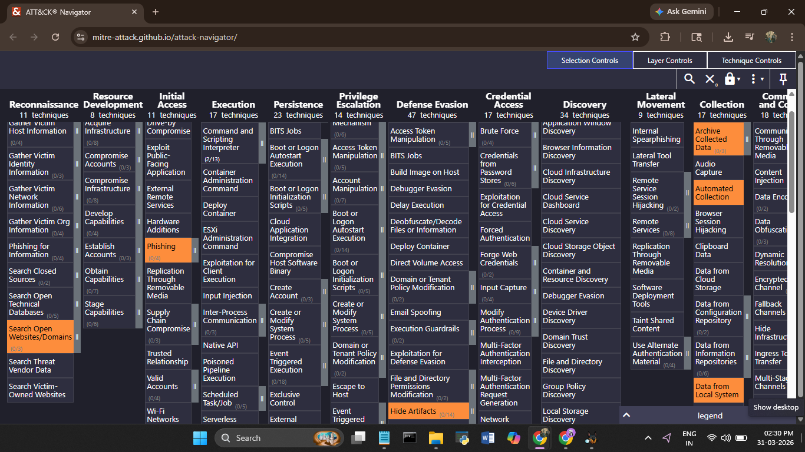
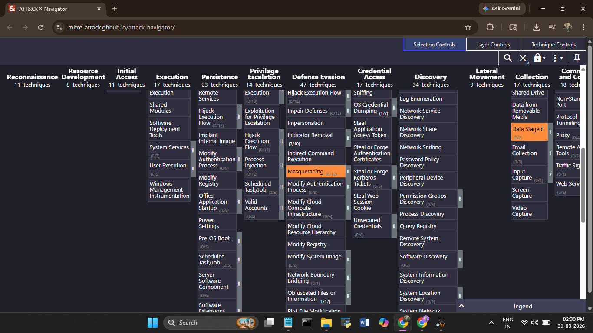

# Day 11 — 29 March 2026
**Internship:** RISE — Cyber Forensics & Threat Intelligence  
**Project:** M57 Digital Forensics Investigation  
**Phase:** Phase 4 — Malware Validation & ATT&CK Mapping  
**Status:** ✅ Complete  

---

## Overview
Today’s work focused on validating suspicious artifacts identified earlier and mapping observed attacker behavior to the MITRE ATT&CK framework.

A previously identified executable (`jo.exe`) was further investigated along with an unidentified temporary file. Additionally, a MITRE ATT&CK layer was created to represent the adversary techniques observed throughout the investigation.

---

## JO.EXE — Execution Evidence (Prefetch Only)

The executable `jo.exe` was **not recovered from the disk image**. However, its Prefetch file (`JO.EXE.pf`) was present.

### Key Finding:
- Presence of Prefetch confirms **execution of the binary**
- Absence of the actual executable suggests:
  - It was **deleted after execution**, or
  - It was executed from an **external device (e.g., USB drive)**

This aligns with earlier findings of **USB device activity on the incident day**, supporting the possibility of external execution.

---

## Suspicious Temporary File Analysis

A previously overlooked temporary file was analyzed:

- **File:** `sc10.bin.tmp`
- **SHA256 Hash:**  
  `0cb8fc24b77159f606e9193afb02537f4c4e8b063d0db8d4c9062c72d06b9581`

### Malware Database Checks

The hash was checked against multiple threat intelligence platforms:

#### MalwareBazaar
- No matches found  
- Not identified as known malware  

#### VirusTotal
- No detections from any vendors  
- No known malicious signatures associated  

### Interpretation

- The file may be:
  - A **previously unknown or custom artifact**
  - A **benign temporary file**
- However, given the broader context (encryption activity, USB usage, anti-forensics), it remains **suspicious**

---

📸 *Figure 2 — MalwareBazaar Result* 
📸 *Figure 3 — VirusTotal Result* 

---

## MITRE ATT&CK Mapping

A MITRE ATT&CK layer was created to map the techniques observed during the investigation.

### Identified Techniques

| Tactic | Technique | Description |
|------|--------|------------|
| Execution | T1204 | User Execution |
| Execution | T1059 | Command-Line Execution (CMD.EXE) |
| Defense Evasion | T1070 | Indicator Removal (Log Clearing, Timestamp Wiping) |
| Defense Evasion | T1027 | Obfuscated/Unknown File (sc10.bin.tmp) |
| Collection | T1005 | Data from Local System |
| Exfiltration | T1052 | Exfiltration over Removable Media (USB) |
| Impact | T1486 | Data Encrypted for Impact (TrueCrypt usage) |

### Key Insight
The mapped techniques indicate a workflow involving:
1. Execution of tools and unknown binaries  
2. Data collection from the system  
3. Encryption using TrueCrypt  
4. Possible exfiltration via USB  
5. Anti-forensic cleanup (log and timestamp manipulation)  

---

📸 *Figure 4 — MITRE ATT&CK Navigator Layer* 

---

## Correlation with Previous Findings

This day’s findings strengthen earlier conclusions:

- `JO.EXE` execution supports **unauthorized binary activity**
- Temporary file analysis adds **unresolved artifact**
- MITRE mapping confirms a **structured attack pattern**
- USB + ShellBags + Prefetch collectively support **data movement hypothesis**

---

## What I Learned Today

- Prefetch artifacts can confirm execution even when binaries are missing  
- Not all suspicious files are detected by malware databases  
- Hash-based analysis has limitations for unknown/custom files  
- MITRE ATT&CK helps translate technical findings into attacker behavior  
- Correlating multiple weak signals can reveal a strong attack narrative  

---
