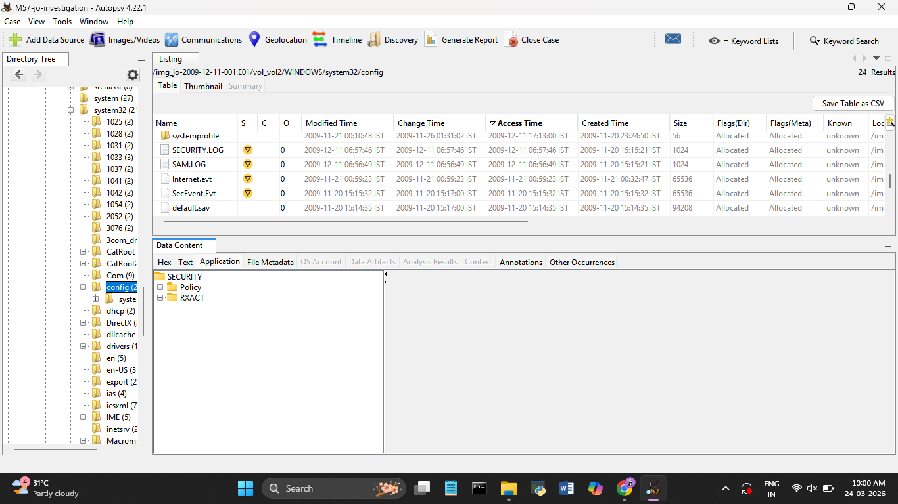

# Day 9 — 27 March 2026

**Internship:** RISE — Cyber Forensics & Threat Intelligence
**Project:** M57 Digital Forensics Investigation
**Phase:** Phase 2 — Windows/System32/config Analysis
**Status:** ✅ Complete

---

## Overview

Investigated the `Windows\System32\config` directory on the incident date. Identified 7 critical files accessed around the same timestamp, pointing to coordinated system-level activity.

---

## Files Identified

| File | Type |
|---|---|
| `SECURITY` | Registry hive |
| `SAM.LOG` | Registry transaction log |
| `SECURITY.LOG` | Registry transaction log |
| `system.LOG` | System log |
| `default.LOG` | Default profile log |
| `AppEvent.evt` | Application event log |
| `SysEvent.evt` | System event log |

---

## Key Findings

**Timestamp:** All files accessed/modified around `2009-12-11 ~22:39 IST`

- **Registry hive access** (`SECURITY`, `SAM`) — stores user accounts, password hashes, security policies
- **Transaction log access** (`SAM.LOG`, `SECURITY.LOG`) — indicates registry changes or modification attempts
- **Simultaneous timestamps** across multiple files — suggests bulk activity or automated script execution
- **Event logs present** (`AppEvent.evt`, `SysEvent.evt`) — can be cross-referenced for login activity and process execution during this window

---

## Forensic Conclusion

Analysis of `Windows\System32\config` shows multiple critical registry hives and log files accessed simultaneously at `2009-12-11 22:39 IST`. The coordinated access pattern across credential stores and their transaction logs suggests either administrative action or malicious activity such as credential access or security configuration modification. Event logs support further timeline reconstruction.

## IOC List

| Type | Value | Reason |
|---|---|---|
| Timestamp | `2009-12-11 22:39 IST` | Mass simultaneous file access |
| File | `SECURITY` hive | Credential/policy data |
| File | `SAM` (via SAM.LOG) | User account hashes |
| File | `SysEvent.evt` | Login/system activity |
| File | `AppEvent.evt` | Application execution records |

---

## What I Learned Today

- Registry hive transaction logs (`.LOG` files) being accessed alongside their parent hives is a strong indicator of registry modification attempts
- Identical timestamps across unrelated system files is a reliable IOC for scripted or automated activity
- `SecEvent.evt` (Security event log) is the most forensically valuable event log — always prioritise it for login and privilege escalation events
