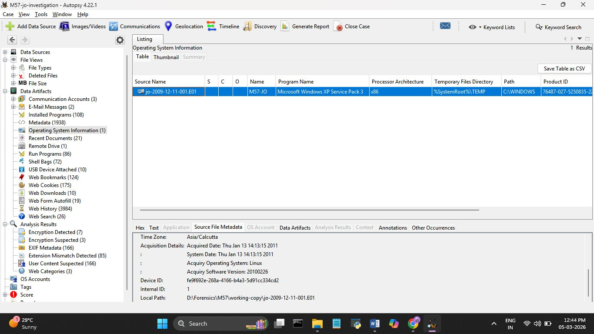
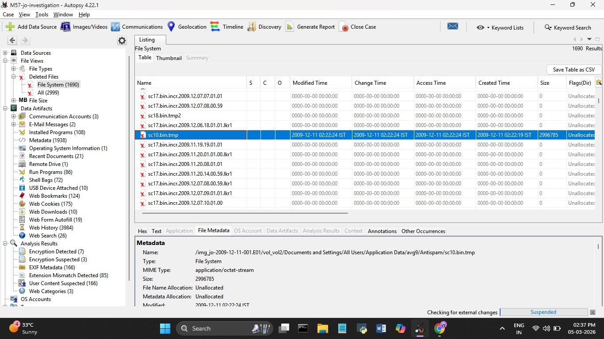
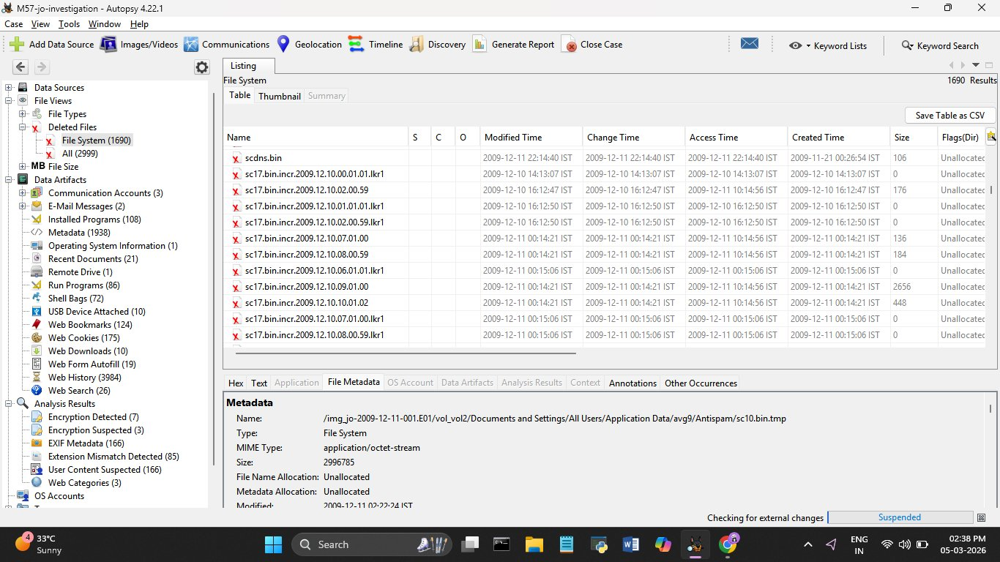
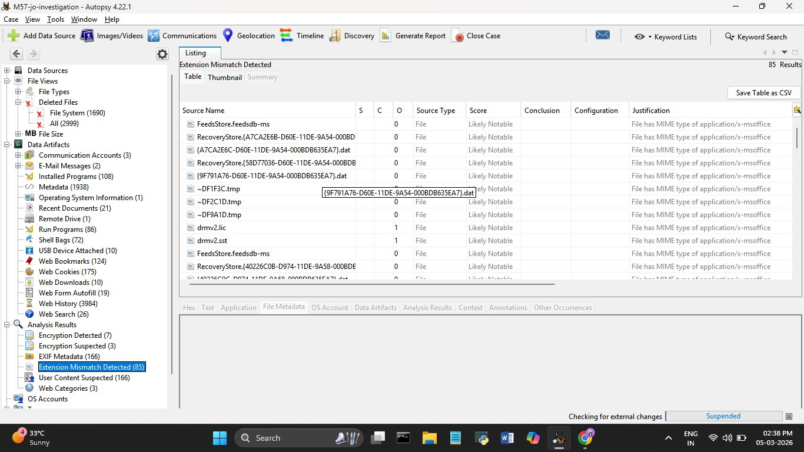
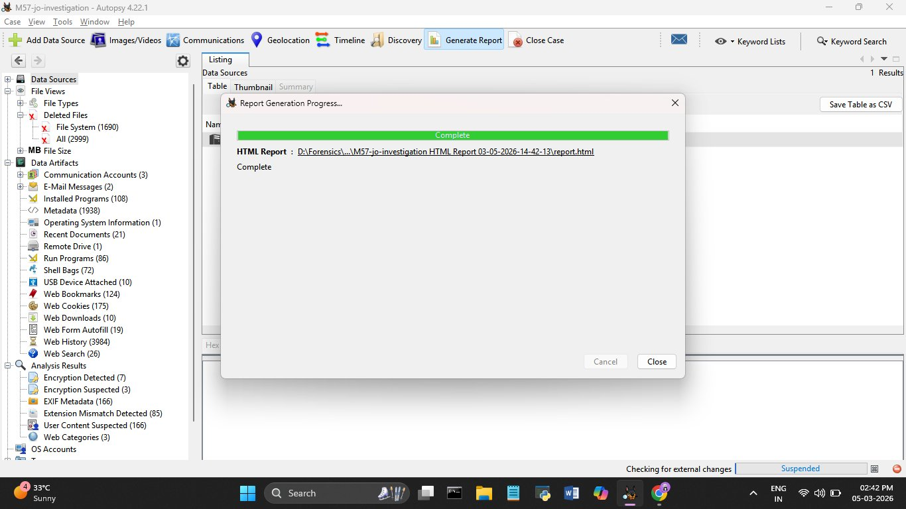

# Day 2 — 05 March 2026
**Internship:** RISE — Cyber Forensics & Threat Intelligence  
**Project:** M57 Digital Forensics Investigation  
**Phase:** Phase 1 — Autopsy Ingest & Initial File System Overview  
**Status:** ✅ Complete

---

## Overview
Day 2 was mostly about going through what Autopsy pulled out after yesterday's ingest 
and trying to make sense of it. Honestly didn't expect to find anything major this early 
but a few things immediately stood out — especially the deleted files section. Most of 
the day was spent cross-checking anomalies and figuring out what's actually suspicious 
vs what's just normal Windows behavior.

---

## Tasks Completed
- ✅ Checked OS information artifact — confirmed Windows XP SP3
- ✅ Browsed file tree: Documents and Settings → Jo → Desktop, My Documents, My Documents/Downloads, Local Settings
- ✅ Went through the Deleted Files view — 1,690 deleted entries
- ✅ Found sc10.bin.tmp sitting alone with valid timestamps while everything around it was wiped
- ✅ Looked through the 85 Extension Mismatch results
- ✅ Checked Recent Documents and Web History
- ✅ Exported the Autopsy HTML report

---

## System Information

*Source: Autopsy → Data Artifacts → Operating System Information*

| Field | Value |
|-------|-------|
| OS Name | Microsoft Windows XP Service Pack 3 |
| Computer Name | M57-JO |
| Processor Architecture | x86 |
| Temp Files Directory | %SystemRoot%\TEMP |
| OS Path | C:\WINDOWS |
| Product ID | 76487-027-5250835-2x |
| Timezone (Acquisition) | Asia/Calcutta (IST = UTC+5:30) |
| Acquisition Date | Thu Jan 13 14:13:15 2011 |
| System Date | Thu Jan 13 14:13:15 2011 |
| Acquiry OS | Linux |
| Acquiry Software Version | 20100226 |
| Device ID | fe9f692e-268a-4166-b4a3-5d91cc334cd2 |
| Local Evidence Path | D:\Forensics\M57\working-copy\jo-2009-12-11-001.E01 |

> **Note:** Autopsy shows all timestamps in IST (UTC+5:30). Need to subtract 5h 30m 
> when putting timestamps into the final report.

---

## File System Overview

| Metric | Count |
|--------|-------|
| Total Deleted Files (File System) | 1,690 |
| Total Files including All categories | 2,999 |
| Extension Mismatches | 85 |
| Encryption Detected | 7 |
| Encryption Suspected | 3 |
| EXIF Metadata Files | 166 |
| User Content Suspected | 166 |
| Web History Entries | 3,984 |
| Web Bookmarks | 124 |
| Web Cookies | 175 |
| Web Downloads | 10 |
| Web Search Terms | 26 |
| Installed Programs | 108 |
| Run Programs | 86 |
| USB Devices Attached | 10 |
| Shell Bags | 72 |
| E-Mail Messages | 2 |
| Recent Documents | 21 |
| Communication Accounts | 3 |

---

## Key Anomalies Found

### Anomaly 1 — `sc10.bin.tmp`: Something doesn't add up here

| Field | Value |
|-------|-------|
| Full Path | /img_jo-2009-12-11-001.E01/vol_vol2/Documents and Settings/All Users/Application Data/avg9/Antispam/sc10.bin.tmp |
| Size | 2,996,785 bytes (~3 MB) |
| MIME Type | application/octet-stream (raw binary) |
| File Name Allocation | Unallocated |
| Metadata Allocation | Unallocated |
| Modified (IST) | 2009-12-11 02:22:24 |
| Change Time (IST) | 2009-12-11 02:22:24 |
| Access Time (IST) | 2009-12-11 02:22:24 |
| Created (IST) | 2009-12-11 02:22:19 |
| Modified (UTC) | 2009-12-10 20:52:24 |
| Created (UTC) | 2009-12-10 20:52:19 |

So this file is sitting inside the AVG Antispam folder which is already weird — what's 
a 3MB unknown binary doing there? But the bigger thing is every single file around it 
has timestamps of `0000-00-00 00:00:00`, completely wiped. This one file has perfectly 
intact timestamps. That contrast is what makes it stand out. Either the wipe didn't 
catch it or it was placed there after the wipe happened. Either way it's going on the 
priority list for Day 5 binary analysis.

---

### Anomaly 2 — 1,690 Deleted Files: Most of them had their timestamps zeroed out

- 1,690 deleted files in File System view, 2,999 total across all categories
- The vast majority show `0000-00-00 00:00:00` for every timestamp field
- This isn't what normal deletion looks like — when you just delete a file, the MFT keeps the timestamps. Zeroing them out takes extra steps
- A few files like `scdns.bin` and the `sc17.bin.incr.*` series still have their timestamps — which is actually useful because those can still be placed on a timeline

The sheer number of wiped timestamps points to someone deliberately trying to remove 
traces of when files were created or accessed. Not accidental. Will keep the files 
with intact timestamps as reference points for the timeline on Day 9.

---

### Anomaly 3 — 85 Extension Mismatches: Office files hiding behind fake extensions

- **85 files flagged**, all scored "Likely Notable" by Autopsy
- All of them are actually `application/x-msoffice` — MS Office documents
- But they're saved with extensions like `.dat`, `.tmp`, `.lic`, `.sst`

| Example File | Fake Extension | True Type |
|-------------|---------------|-----------|
| FeedsStore.feedsdb-ms | .feedsdb-ms | MS Office |
| {A7CA2E6B-D60E-11DE-9A54-000BD...}.dat | .dat | MS Office |
| RecoveryStore.{58D77036...}.dat | .dat | MS Office |
| ~DF1F3C.tmp | .tmp | MS Office |
| ~DF2C1D.tmp | .tmp | MS Office |
| ~DF9A1D.tmp | .tmp | MS Office |
| drmv2.lic | .lic | MS Office |
| drmv2.sst | .sst | MS Office |

A normal user doesn't rename 85 documents to look like system files. Some of these 
could be legit Windows/Office temp behavior but 85 is way too many to ignore. Need to 
open each one and see what's actually inside — that's Day 6 work.

---

### Anomaly 4 — 7 Encrypted + 3 Suspected Encrypted Files

Nothing to deep-dive yet but flagging it. Autopsy's entropy scan picked up 7 files 
as encrypted and 3 more as suspected. On a work laptop that's worth looking into — 
could be nothing, could be data being prepped for exfiltration. Will look at this in Day 7 during binary analysis.

---

### Anomaly 5 — Recent Documents & Web History: Not much here yet

- Recent Documents had 21 entries, mostly US Patent documents — matches Jo's role so nothing jumps out yet
- Web History has 3,984 entries but some IE sessions had no title and no URL at all — blank entries like that can mean InPrivate browsing or someone cleared history but Autopsy still picked up the sessions
- 26 web search terms — haven't gone through all of them, that's Day 4

Not calling these suspicious yet. Will make more sense once I compare against the 
event logs and network traffic later on.

---

## Autopsy HTML Report

| Item | Value |
|------|-------|
| Report Type | HTML |
| Report Path | D:\Forensics\...\M57-jo-investigation HTML Report 03-05-2026-14-42-13\report.html |
| Status | Complete ✅ |
| Generated | 05 March 2026 — 14:42 IST |

---

## What I Learned Today
- The timestamp contrast around sc10.bin.tmp taught me that context matters more than 
  the artifact itself — one file with valid timestamps in a sea of zeroed-out ones is 
  actually more suspicious than if everything had timestamps
- Extension mismatches at this scale aren't noise — 85 Office files hiding as .dat and 
  .tmp is deliberate
- Zeroing timestamps takes deliberate effort, normal deletion doesn't do that
- Not everything suspicious on day 2 will turn out to be evidence — some of this will 
  get explained away by Day 6 once the event logs are in

---

## Next Steps (Day 3)
- Start building the Suspicious Files Table with proper UTC timestamps
- Look at sc10.bin.tmp in the Hex tab — see if anything readable is in there
- Browse Jo's Desktop, My Documents, and Downloads folders in detail
- Check Installed Programs for anything unusual
- Extension mismatches and USB devices will be covered in Day 6
- Email artifacts will be covered in Day 4 and 5
