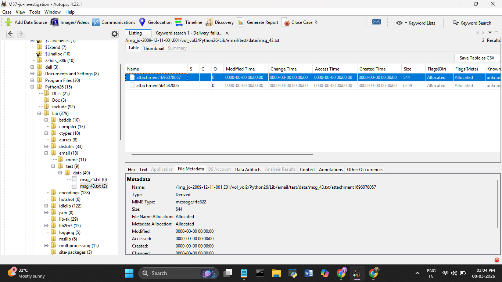
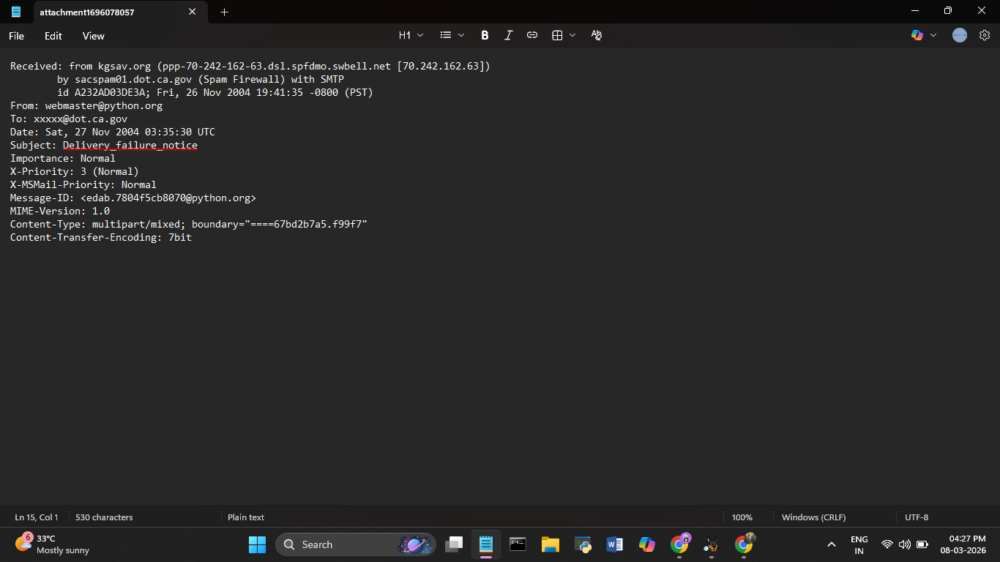

# Day 5 — 08 March 2026
**Internship:** RISE — Cyber Forensics & Threat Intelligence  
**Project:** M57 Digital Forensics Investigation  
**Phase:** Phase 2 — Browser, Email & Communication Artifacts  
**Status:** ✅ Complete

---

## Overview
Today started simple — just checking the 2 email messages. Ended up being the most 
interesting day so far. One of those emails unraveled into spoofed identity, falsified 
dates, a hidden attachment buried in a Python system folder, and a recipient list that 
suggests this was planned.

---

## Email Artifacts

*Source: Autopsy → Data Artifacts → E-Mail Messages*

| File | From | To | Subject | Date Received |
|------|------|----|---------|---------------|
| msg_25.txt | MAILER-DAEMON@zinfandel.lacita.com | linuxuser-admin@www.linux.org.uk | Returned mail: Too many hops 19 (17 max) | 2001-04-06 22:53:06 |
| msg_43.txt | ; >; | webmaster@python.org | Banned file: auto__mail.python.bat in mail from you | 2004-11-27 09:11:44 |

Only 2 emails on an entire work laptop. The mailbox was almost certainly wiped — 
these two just got left behind.

---

## msg_43.txt — Full Breakdown

**File Timestamps:**

| | IST |
|--|-----|
| Received | 2004-11-27 09:11:44 |
| Created | 2005-10-29 08:37:18 |
| Modified | 2005-10-29 08:37:18 |
| Accessed | 2009-11-23 23:53:41 |
| Changed | 2009-11-23 23:53:41 |

Received in 2004, file created in 2005 — that gap is already off. More importantly 
it was accessed in **November 2009**, less than 3 weeks before the incident date. 
Someone opened this right before everything happened.

**What the email actually is:**

The From field is just `; >;` — no real address. The subject is `Delivery_failure_notice` 
which looks like a bounce from a mail server. It wasn't. It was sent to **25 recipients**, 
all at the **California Department of Transportation** (`@dot.ca.gov`). The second 
attachment `attachment564582006` contains the full delivery failure report — every 
single recipient got a `550 5.7.1 BANNED: auto__mail.python.bat` rejection, meaning 
the California DOT spam filter blocked it for all 25 targets. The fact that there's a 
prepared list of 25 government addresses means this wasn't spontaneous — it was planned. 
Using a fake delivery failure subject is social engineering — it looks like a system 
message, more likely to be opened, less likely to get flagged. The email was blocked 
because it contained `auto__mail.python.bat`, a `.bat` executable script.


---

## Finding the Attachment

Couldn't find the attachment manually among the 85 extension mismatch files so ran 
a keyword search for `Delivery_failure_notice` in Autopsy.

**Attachment location:**
```
/img_jo-2009-12-11-001.E01/vol_vol2/Python26/Lib/email/test/data/msg_43.txt/attachment1696078057
```

That's inside Python's library test data folder — not anywhere near a normal email 
storage path. Normal locations would be under `AppData/Thunderbird/Profiles/` or 
`Local Settings/Application Data/`. Putting it here was deliberate — it blends in 
with system files.

**Attachment metadata — completely wiped:**

| | |
|--|--|
| Modified | 0000-00-00 00:00:00 |
| Accessed | 0000-00-00 00:00:00 |
| Created | 0000-00-00 00:00:00 |
| Changed | 0000-00-00 00:00:00 |

The MIME type is `message/rfc822` — the attachment is an email itself. Jo embedded 
a mail inside a mail. There's also a second attachment `attachment564582006` — that 
one is the delivery failure report from the California DOT spam server, listing all 
25 blocked recipients with `550 5.7.1 BANNED: auto__mail.python.bat` for each one. 
This confirms the email reached the spam filter for all 25 targets before being rejected.



---

## Inside the Attachment

Extracted `attachment1696078057` and opened in Notepad. The full email headers 
revealed what was actually going on:



**Breaking it down:**

| | |
|--|--|
| Actually sent from | kgsav.org via DSL home connection in Springfield, Missouri |
| Received by | sacspam01.dot.ca.gov — California DOT spam filter (this is why it was blocked) |
| Fake sender | webmaster@python.org — spoofed, not actually from Python.org |
| Connection type | ppp = DSL home internet, swbell = Southwestern Bell ISP |

The email was sent from a **personal home DSL connection**, not M57's corporate 
network. Jo deliberately used an external connection to avoid going through the 
company mail server.

**On the date — 2004 on a 2009 machine:**

The firewall received it at `Fri, 26 Nov 2004 19:41:35 PST` and the header says 
`Sat, 27 Nov 2004 03:35:30 UTC` — those actually match (PST is UTC-8). But the 
case is from 2009. The date was deliberately falsified — classic anti-forensics to 
throw off the timeline.

---

## What I Learned Today
- Social engineering shows up in forensics too — a fake delivery failure subject is 
  designed to bypass both humans and spam filters
- rfc822 MIME type means the attachment is a full email — mail inside a mail is an 
  unusual but real technique
- Hiding files in system library folders (Python test data) is more effective than 
  hiding them in user folders because investigators tend to skip those areas
- A second attachment with the recipient list means this wasn't spontaneous — 
  it was planned

---
