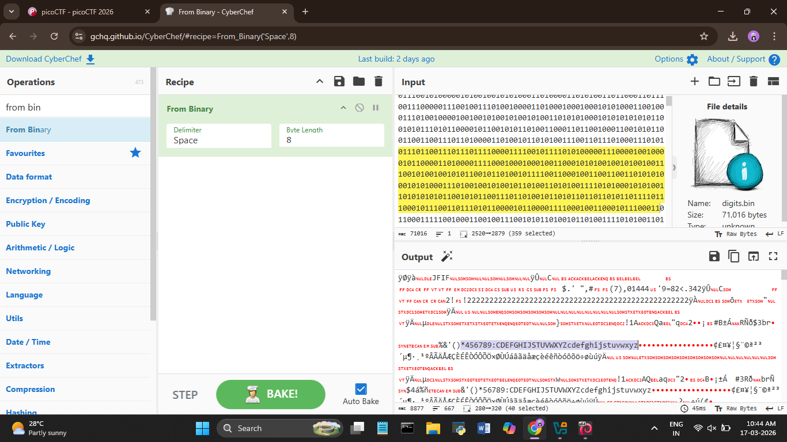
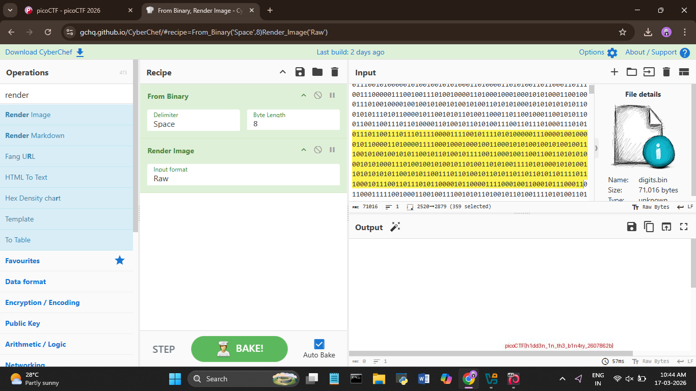

# picoCTF 2026 – Binary Digits

**Category:** Forensics

**Difficulty:** Easy

---

## What's the challenge about?

We're given a `.bin` file full of 0s and 1s. The goal is to figure out what's hiding inside all that binary.

---

## Where do you even start?

The simplest approach — drag and drop the file into CyberChef and add a **From Binary** recipe. The output was mostly garbage, but something caught my eye in the middle of it:

```
456789:CDEFGHIJSTUVWXYZcdefghijstuvwxyz
```

That didn't look like the rest of the garbage. After a quick search, that's actually part of a JPEG image header and footer — the binary data was encoding an image.



---

## Rendering the image

So I added **Render Image** to the recipe right after From Binary. CyberChef rendered it directly in the output — and there was the flag sitting in the image.



---

## Flag

```
picoCTF{h1dd3n_1n_th3_b1n4ry_2607862b}
```

---

## What I took away from this

Binary files don't always decode to text. If the output looks like garbage but has recognisable patterns in it, it might be an image or another file type hiding inside. CyberChef's Render Image operation makes it easy to check.

---

## Tools used

- **CyberChef** — From Binary + Render Image
