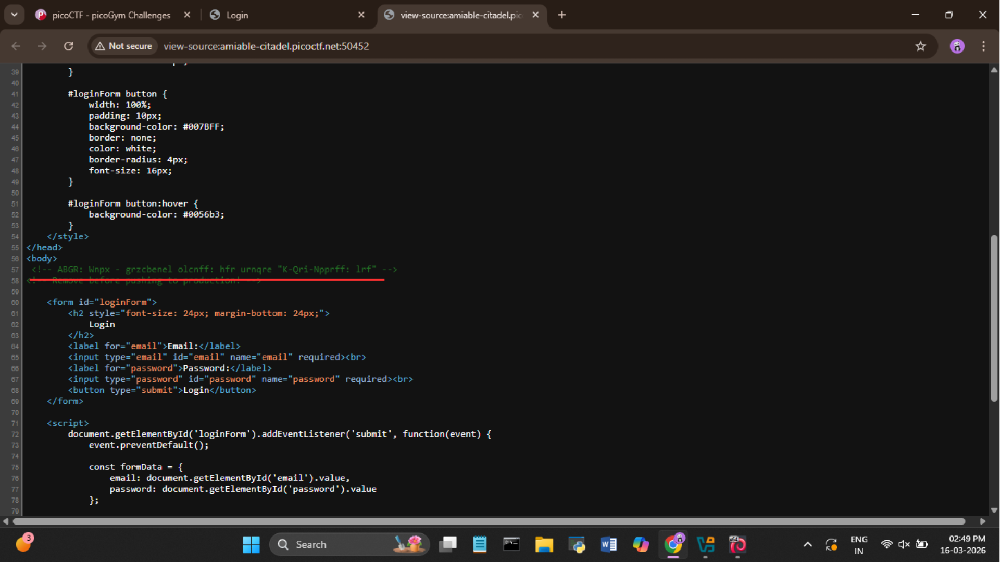

# picoCTF – Crack the Gate 1

**Category:** Web Exploitation

**Difficulty:** Easy

---

## What's the challenge about?

We're given a website and an email address — no password. The goal is to find the flag. Since there's no password to log in with, there has to be another way in.

---

## Where do you even start?

The first thing that came to mind was to inspect the source code. Developers often leave things in there they shouldn't — and sure enough, buried in the HTML comments was this:

```
ABGR: Wnpx - grzcberel olcnff: hfr urnqre "K-Qri-Npprff: lrf"
```

That's clearly not normal. The shifted letters gave it away pretty quickly — that's ROT13.



---

## Decoding the comment

I threw it into CyberChef with ROT13 and got back:

```
NOTE: Jack - temporary bypass: use header "X-Dev-Access: yes"
```

So there's a hidden developer backdoor sitting right there in the source. `X-Dev-Access: yes` is a custom HTTP header that was left in as a temporary bypass — and never removed. That's our way in.


---

## Getting the flag with curl

Now I needed to send a login request with that header attached. I tried logging in normally first — "Invalid credentials" as expected.


So I opened DevTools → Network tab → submitted the login again → right-clicked the login request → Copy → Copy as cURL (cmd).


Opened CMD (`Win + R → cmd`), pasted the curl command, and added the bypass header at the end:

```
-H "X-Dev-Access: yes"
```

Ran it, and the server handed back the flag in the response.


---

## Flag

```
picoCTF{brut4_f0rc4_b3a957eb}
```

---

## What I took away from this

The bypass was sitting in the source code the whole time, just encoded. The solve chain was: view source → spot the encoded comment → ROT13 decode → find the hidden header → copy the request as curl → add the header → flag.

Always check the page source. Developers leave notes in there they really shouldn't.

---

## Tools used

- Browser source view — finding the hidden comment
- **CyberChef** — decoding the ROT13 comment
- **DevTools** (Network tab) — copying the login request as cURL
- **curl** (Windows CMD) — sending the request with the bypass header
