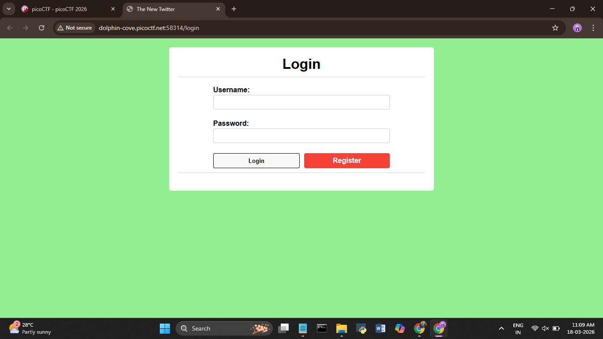
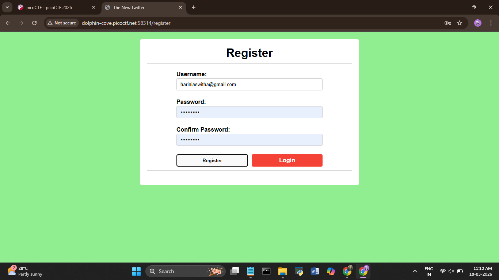
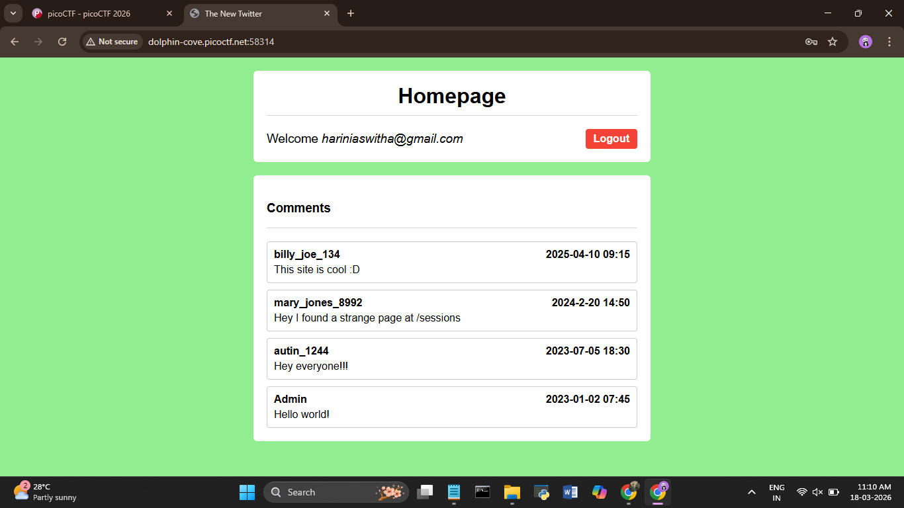
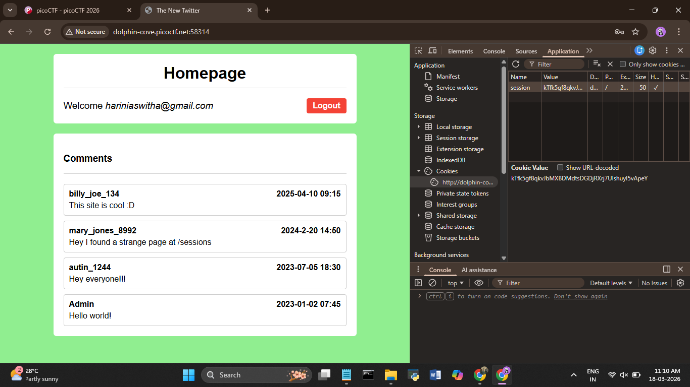
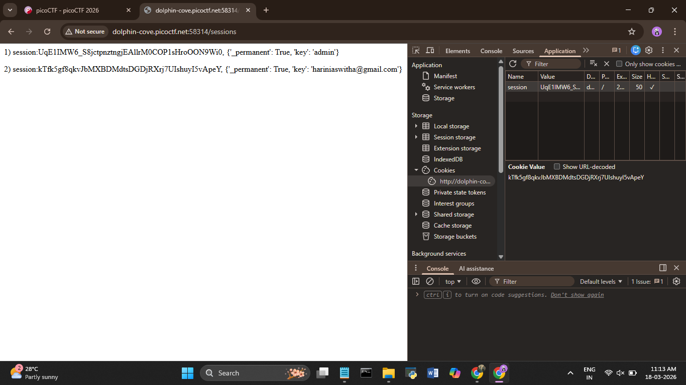
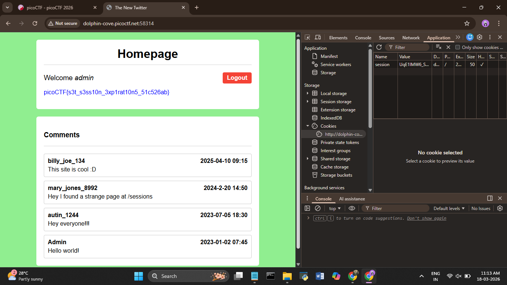

# picoCTF 2026 – Old Session

**Category:** Web Exploitation

**Difficulty:** Easy

---

## What's the challenge about?

The challenge talks about session timeout misconfigurations. If sessions never expire and someone leaves their account logged in, anyone who gets hold of that session cookie can just walk right in — no password needed. We're told the site owner hates logging in, so he set up his sessions to never expire. Our job is to use that against him.

---

## Where do you even start?

There's a link to a social media site. I hit the login page and tried random credentials and got in — the site registered me as a new user. The challenge hints mentioned the web inspector and cookies, so that's where I went.





---

## Poking around the site

After logging in, the homepage showed some comments. One of them from `mary_jones_8992` stood out:

> *"Hey I found a strange page at /sessions"*

That's a hint right there. I added `/sessions` to the URL and it dropped me onto a page listing all active session cookies — including one for **admin**.



---

## Stealing the admin session

I opened DevTools → Application → Cookies and could see my own session cookie. I copied the admin session value from the `/sessions` page, went back to the cookies panel, and replaced my session value with the admin one.

 



Refreshed the page — now logged in as admin, and the flag was sitting right there on the homepage.



---

## Flag

```
picoCTF{s3t_s3ss10n_3xp1rat10n5_51c526ab}
```

---

## What I took away from this

Sessions that never expire are a real security issue — this isn't just a CTF thing. If an attacker can get hold of a valid session token (and here the site was literally listing them all at `/sessions`), they can impersonate any user without ever knowing their password. Always check for exposed endpoints and never leave session expiry misconfigured.

---

## Tools used

- Browser DevTools (Application → Cookies) — viewing and replacing session cookies
