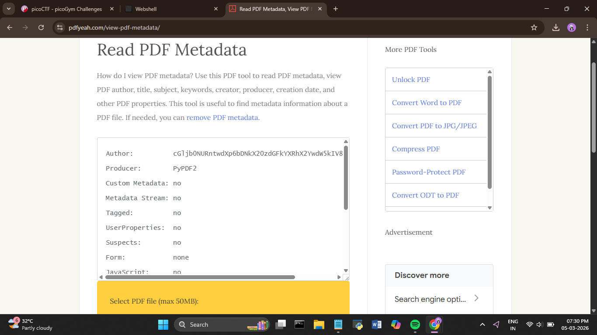
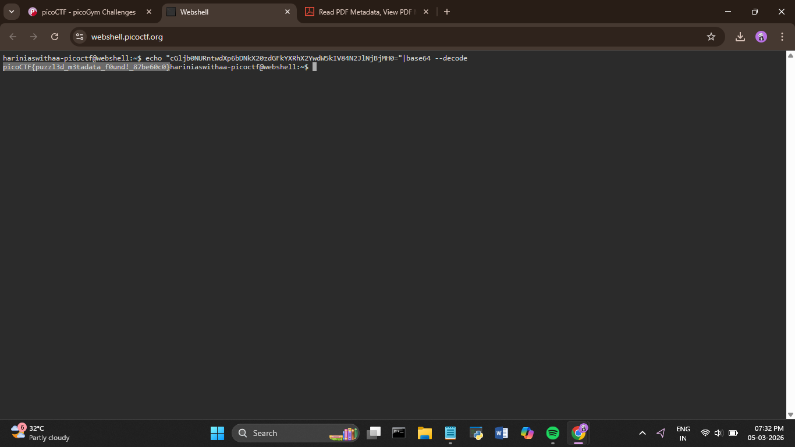

# picoCTF – Riddle Registry

**Category:** Forensics  
**Difficulty:** Easy  
**Event:** picoCTF  

---

## Challenge Description

> A PDF file is provided that appears to contain scrambled, unreadable text. The challenge hint mentions that something is hidden, and suggests uncovering the flag using the file's **metadata**.

---

## Approach

At first glance, the PDF contained nothing but garbled nonsense — the visible text was clearly obfuscated and offered no useful information. However, the challenge description specifically hinted at **metadata**, which shifted the focus away from the document content itself.

---

## Solution

### Step 1 – Analyse the PDF Metadata

Using an **online PDF metadata viewer**, I inspected the file's properties. Buried in the metadata fields was a suspicious value in the **Author** field — a string of scrambled letters and numbers that looked like Base64-encoded text.



---

### Step 2 – Decode the Base64 String

Taking the encoded value from the Author field, I decoded it using the following command in a web shell:

```bash
echo "[base64_value]" | base64 --decode
```

This revealed the flag.



---

## Flag

```
picoCTF{XXXXXXXXXXXXXXXX}
```

---

## Key Takeaways

- **Always check metadata** — CTF PDFs (and other files) frequently hide flags in metadata fields like Author, Title, or Creator.
- **Base64 is a common encoding** in CTF challenges. Recognising the pattern of letters and numbers is a useful skill.
- Tools like `exiftool`, browser-based PDF metadata viewers, or `pdfinfo` are handy for quickly surfacing hidden metadata.

---

## Tools Used

| Tool | Purpose |
|------|---------|
| Online PDF Metadata Viewer | Extract hidden metadata from the PDF |
| `base64` (bash/web shell) | Decode the encoded flag value |
