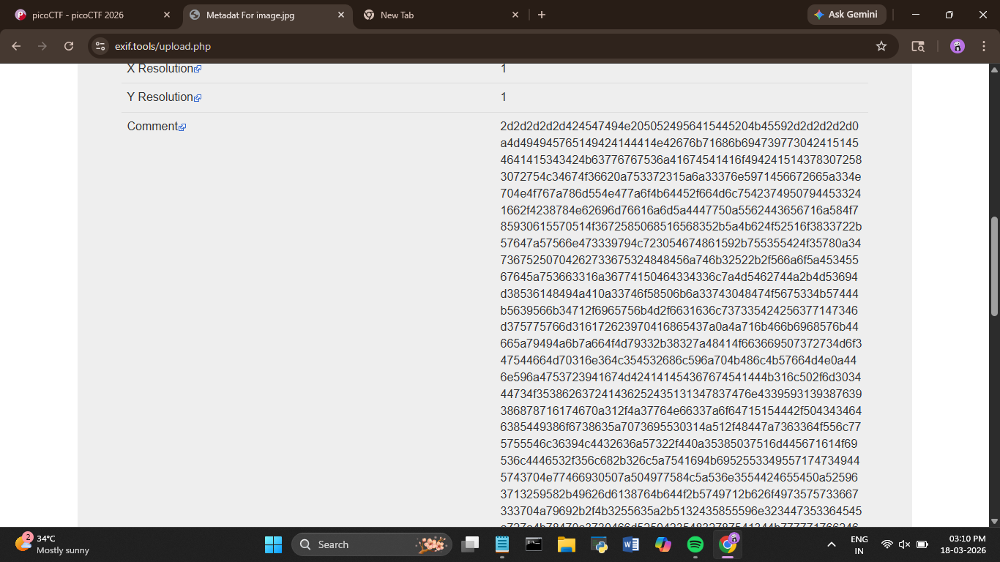
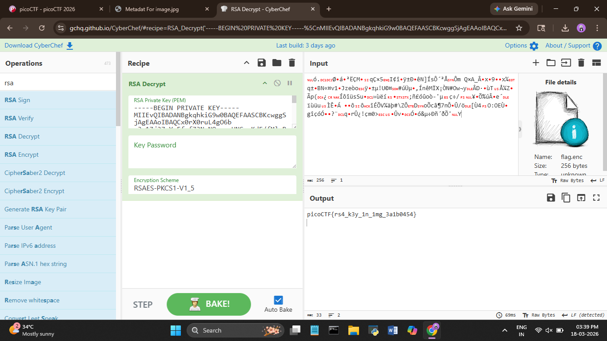

# picoCTF 2026 – StegoRSA

**Category:** Cryptography

**Difficulty:** Easy

---

## What's the challenge about?

A message has been encrypted with RSA. The public key is gone, but the challenge hints that someone was careless with the private key. We're given two files — an encrypted `.enc` file and an image. Our job is to recover the private key and decrypt the message.

---

## Where do you even start?

Two files, one image, one encrypted message. The image is suspicious — why give us an image for a cryptography challenge? The answer is in the metadata.

I ran the image through an online metadata viewer and hit the **Comment** field — a massive wall of hex that clearly wasn't a normal camera comment.



---

## Extracting the private key

I copied the hex string into CyberChef and used the **Magic** recipe to let it figure out the encoding automatically. It decoded to a **RSA private key** — a full PEM-formatted private key just sitting there in the image metadata.


---

## Decrypting the flag

Now I had the private key and the `.enc` file. I loaded both into CyberChef using **RSA Decrypt** — private key in the key box, the `.enc` file as the input.

I usually go with Raw for CTF RSA challenges first, but it didn't work here. So I tried the other schemes — turned out the author used **RSAES-PKCS1-V1_5**. Switched to that and the flag came out clean.



---

## Flag

```
picoCTF{rs4_k3y_1n_1mg_3a1b0454}
```

---

## What I took away from this

Always check image metadata — this challenge hid an RSA private key in the Comment field, which is the last place most people would think to look. Also, when RSA decryption fails, it's worth trying different padding schemes. RSAES-PKCS1-V1_5 is common but not the default assumption.

---

## Tools used

- Online metadata viewer (exif.tools) — extracting the private key from the image
- **CyberChef** — Magic recipe to decode hex, RSA Decrypt to get the flag
