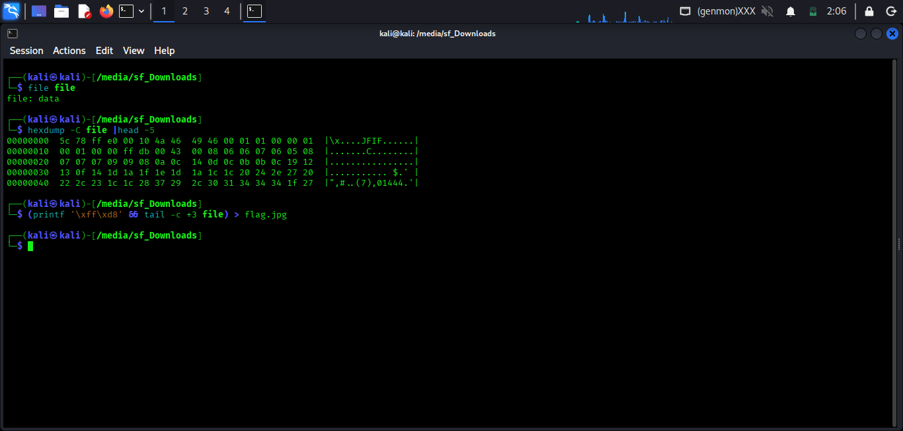

# Corrupted File — picoCTF

| Field       | Details         |
|-------------|-----------------|
| **CTF**     | picoCTF         |
| **Category**| Forensics       |
| **Challenge**| Corrupted File |
| **Difficulty** | Easy         |
| **Flag**    | `picoCTF{r3st0r1ng_th3_by73s_939a65f5}` |

---

## 📋 Challenge Description

We were given a file simply named `file`. The goal was to investigate the corrupted file, identify its true type, repair it, and extract the hidden flag.

---

## 🛠️ Tools Used

| Tool       | Purpose                              |
|------------|--------------------------------------|
| `file`     | Identify file type                   |
| `hexdump`  | Inspect raw bytes / magic bytes      |
| `printf`   | Reconstruct correct magic bytes      |

---

## 🔍 Step-by-step Solution

### Step 1 — Check the File Type

Running the `file` command on the given file returned a generic result:

```bash
file file
```

```
file: data
```

This told us the file type was unrecognized — a clear sign the file header was corrupted.

---

### Step 2 — Inspect the Hex Dump

To dig deeper, we used `hexdump` to inspect the raw bytes at the start of the file:

```bash
hexdump -C file | head -5
```



The output revealed the string `JFIF` in the early bytes — a strong indicator that this was originally a **JPEG image**. However, the magic bytes at the very beginning were corrupted and didn't match the expected JPEG signature.

A valid JPEG file must begin with the magic bytes:
```
FF D8 FF E0
```

---

### Step 3 — Repair the File

Since only the first few bytes were corrupted, we patched them using `printf` and reconstructed a valid JPEG:

```bash
(printf '\xff\xd8' && tail -c +3 file) > flag.jpg
```

This replaces the corrupted leading bytes with the correct JPEG magic bytes (`FF D8`) while keeping the rest of the file intact.


---

### Step 4 — Retrieve the Flag

Opening `flag.jpg` revealed the flag embedded in the image:

```
picoCTF{r3st0r1ng_th3_by73s_939a65f5}
```

---

## 💡 Key Learnings

- Every file format has a **magic byte signature** at the start of its header. Recognizing these is a core forensics skill.
- When `file` returns `data`, it usually means the header is missing or corrupted — `hexdump` is your next step.
- Simple **byte patching** with `printf` + `tail` is an effective way to repair files with corrupted headers without needing specialized tools.
- **JPEG magic bytes:** `FF D8 FF E0` — worth memorizing for forensics challenges.
