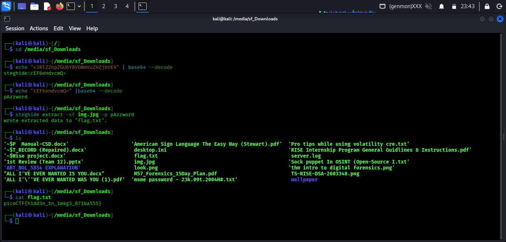

# picoCTF – Hidden in Plainsight

**Category:** Forensics 
**Difficulty:** Easy

---

## What's the challenge about?

We're given an image file and told to find the flag. The name "Hidden in Plainsight" is already a nudge — something's there, you just have to know where to look.

---

## Where do you even start?

With any image challenge, the first thing I do is check the metadata. People often overlook it, but image files carry a lot more information than just the pixels — things like camera settings, GPS data, and custom comment fields. And CTF authors love stuffing things in there.

So I ran `exiftool` on the image and started scanning through the fields. Most of it was normal stuff, but then I hit the **Comment** field:

```
c3RlZ2hpZGU6Y0VGNmVuZHZjbVE9
```

That's not a camera comment. That looks like Base64.

---

## Peeling back the layers

I threw it into a Base64 decode:

```bash
echo "c3RlZ2hpZGU6Y0VGNmVuZHZjbVE9" | base64 --decode
```

And got back:

```
steghide:cEF6endvcmQ=
```

Okay, two things here — `steghide` (a steganography tool) and *another* Base64 string. Classic double-encoding. Let's decode that second one too:

```bash
echo "cEF6endvcmQ=" | base64 --decode
```

Result:

```
pAzzword
```

So now I have a tool and a password. The image is hiding something, and `steghide` is how we get to it.

---

## Extracting the hidden data

If you haven't used steghide before, it's a tool that lets you embed files inside images or audio. You'd never know anything was there just by looking at the image. To extract whatever's hidden inside:

```bash
sudo apt install steghide   # if you don't have it already
steghide extract -sf image.jpg -p pAzzword
```

This drops a `flag.txt` file in the current directory. One more command:

```bash
cat flag.txt
```


---

## Flag

```
picoCTF{h1dd3n_1n_1m4g3_871ba555}
```

---

## What I took away from this

The challenge title was doing a lot of work — the password and the tool name were sitting right there in the metadata the whole time, just encoded. The solve chain was: spot the weird comment field → decode Base64 → decode it *again* → use the password with steghide → profit.

It's a good reminder to never skip metadata. Also, if something decodes into another encoded string, don't stop — keep pulling the thread.

---

## Tools used

- `exiftool` — metadata extraction  
- `base64` — decoding the comment field (twice)  
- `steghide` — extracting the hidden file from the image
